Сделано вместе с [caz1que](https://github.com/caz1que)
## Перед началом работы

</br>

Ознакомиться с полным текстом задания можно тут: 
- [Вариант 1](https://poligon218.ru/demoexam/demo2024/09-02-06-1-2024/)
- [Вариант 2](https://poligon218.ru/demoexam/demo2024/09-02-06-2-2024/)

Ознакомиться с топологией сети можно тут: [network.md](https://github.com/caz1que/DEM0/blob/main/network.md)

Ознакомиться со списком учетных записей на ВМ и паролями от них можно тут: [login.md](https://github.com/caz1que/DEM0/blob/main/login.md)

Используемые дистрибутивы в работе:
- **Debian 12**
- **Fedora Server 39**

Вся работа выполнялась на гипервизоре **VMware ESXi 6.5.0**.

Ссылка на образы (Debian 12, Fedora 39 Server, VMWare ESXi 6.5.0, VMWare ESXi 8.0, VMWare Workstation 16): [Google Drive](https://drive.google.com/drive/u/1/folders/1o1KZsl7oiDTPmwY0MXxIZBm9twDEw8PT)

</br>

## Содержание

</br>

├ [Модуль 1. Выполнение работ по проектированию сетевой инфраструктуры.](#module_1) </br>
├── [Базовая настройка устройств](#module_1_1) </br>
├── [FRR](#module_1_2) </br>
├── [DHCP](#module_1_3) </br>
├── [Учетные записи пользователей](#module_1_4) </br>
├── [iperf3](#module_1_5) </br>
├── [Backup-скрипты](#module_1_6) </br>
├── [SSSH на 2222 порту](#module_1_7) </br>
└── [Контроль доступа SSH](#module_1_8) </br>

</br>

├ [Модуль 2. Организация сетевого администрирования.](#module_2) </br>
├── [DNS + Домен](#module_2_1) </br>
├── [NTP](#module_2_2) </br>
├── [SMB](#module_2_4)  </br>
├── [LMS Apache](#module_2_5) </br>
└── [MediaWiki, Docker, MySQL](#module_2_6) </br>

</br>

├ [Модуль 3. Эксплуатация объектов сетевой инфраструктуры.](#module_3) </br>
├── [Мониторинг rsyslog](#module_3_1) </br>
├── [Центр сертификации](#module_3_2) </br>
├── [Настройка SSH](#module_3_3) </br>
├── [ClamAV](#module_3_4) </br>
├── [Система управления трафиком BR-R](#module_3_5) </br>
├── [CUPS](#module_3_6) </br>
├── [Туннель HQ-BRANCH](#module_3_7) </br>
├── [Параметры мониторинга](#module_3_8) </br>
├── [RAID 5](#module_3_9) </br>
└── [Bacula](#module_3_10) </br>

</br>

## Сделай это в самом начале

</br>

На всех машинах с **Debian 12** необходимо ввести команду:

```console
apt-cdrom add
```

Это позволит скачивать пакеты из оффлайн репозитория.

</br>

Также не забудь скачать везде **ssh**:

```console
apt install ssh
```

</br>

На **HQ-SRV** ssh уже установлен.

</br>

**ВЫКЛЮЧАЕМ firewalld** на **HQ-SRV**!!!

```console
[root@hq-srv ~]# systemctl stop firewalld
[root@hq-srv ~]# systemctl disable firewalld
```

---

</br>

## <a id="module_1">Модуль 1. Выполнение работ по проектированию сетевой инфраструктуры. </a>

</br>

### <a id="module_1_1">1. Выполните базовую настройку всех устройств. </a>

<details> <summary> Open me! </summary>

</br>

**1.1 Присвойте имена в соответствии с топологией.**

Присваивание hostname выполняется при помощи утилиты **hostnamectl** и команды set-hostname.

```console
hostnamectl set-hostname *hostname*
```

</br>

**1.2 Рассчитайте IP-адресацию IPv4 и IPv6. Необходимо заполнить таблицу №1, чтобы эксперты могли проверить ваше рабочее место.**

</br>

**ISP** - /etc/network/interfaces

```console
auto ens161
iface ens161 inet static
  address 192.168.100.1
  netmask 255.255.255.0

auto ens256
iface ens256 inet static
  address 10.10.1.1
  netmask 255.255.255.252

auto ens224
iface ens224 inet static
  address 10.10.2.1
  netmask 255.255.255.252
```

</br>

**HQ-R** - /etc/network/interfaces

```console
auto ens256
iface ens256 inet static
  address 172.16.2.1
  netmask 255.255.255.192

auto ens224
iface ens224 inet static
  address 10.10.1.2
  netmask 255.255.255.252
  gateway 10.10.1.1
```

</br>

**BR-R** - /etc/network/interfaces

```console
auto ens256
iface ens256 inet static
  address 192.168.33.1
  netmask 255.255.255.240

auto ens224
iface ens224 inet static
  address 10.10.2.2
  netmask 255.255.255.252
  gateway 10.10.2.1
```

</br>

**BR-SRV** - /etc/network/interfaces

```console
auto ens224
iface ens224 inet static
  address 192.168.33.10
  netmask 255.255.255.240
  gateway 192.168.33.1
```

</br>

На **HQ-SRV** пока ничего не трогаем до момента настройки DHCP.

</br>

**1.3 Пул адресов для сети офиса BRANCH — не более 16.**

Используем /28 маску (255.255.255.240)

</br>

<details> <summary> Пример расчета маски BRANCH </summary>

</br>

Для начала запишем степени двойки. Они пригодятся.

...

2^1 = 2

2^2 = 4

2^3 = 8

2^4 = 16

2^5 = 32

2^6 = 64

2^7 = 128

...

Смотрим подходящую степень двойки. Ее результат не должен превышать необходимое количество адресов подсети.

В нашем случае это:

2^4 = 16

В 11111111.11111111.11111111.11111111 последние 4 чисел должны быть нулями (4, потому что подходящая степень двойки - 4), следовательно:

11111111.11111111.11111111.11110000 (/28)

Переводим в десятичную.

11111111 = 255

11110000 = 2^7 + 2^6 + 2^5 + 2^4 = 128 + 64 + 32 + 16 = 240

</br>

Результат:

255.255.255.240

</details>

</br>

**1.4 Пул адресов для сети офиса HQ — не более 6.**

Используем /26 маску (255.255.255.192)

</br>

<details> <summary> Пример расчета маски HQ </summary>

</br>

Для начала запишем степени двойки. Они пригодятся.

...

2^1 = 2

2^2 = 4

2^3 = 8

2^4 = 16

2^5 = 32

2^6 = 64

2^7 = 128

...

Смотрим подходящую степень двойки. Ее результат не должен превышать необходимое количество адресов подсети.

В нашем случае это:

2^6 = 64

В 11111111.11111111.11111111.11111111 последние 6 чисел должны быть нулями (6, потому что подходящая степень двойки - 6), следовательно:

11111111.11111111.11111111.11000000 (/27)

Переводим в десятичную.

11111111 = 255

11000000 = 2^7 + 2^6 = 128 + 64 = 192

</br>

Результат:

255.255.255.192

</details>

</br>

Таблица №1. 

| Имя устройства | IP                                    |
|----------------|---------------------------------------|
| CLI            | 192.168.100.100                       |
| ISP            | 10.10.1.1, 10.10.2.1, 192.168.100.1   |
| HQ-R           | 10.10.1.2, 172.16.2.1                 |
| HQ-SRV         | 172.16.2.2                            |
| BR-R           | 10.10.2.2, 192.168.33.1               |
| BR-SRV         | 192.168.33.2                          |
| HQ-CLI         | DHCP                                  |
| HQ-AD          | 172.16.2.3                            |

</details> 

---

</br>

### <a id="module_1_2">2. Настройте внутреннюю динамическую маршрутизацию по средствам FRR. Выберите и обоснуйте выбор протокола динамической маршрутизации из расчёта, что в дальнейшем сеть будет масштабироваться. </a>

<details> <summary> Open me! </summary>

</br>

На виртуальных машинах **HQ-R, BR-R и ISP** включаем пересылку пакетов, редактируя файл */etc/sysctl.conf*.

```console
root@HQ-R:~# nano /etc/sysctl.conf
```

```console
...
Uncomment the next line to enable packet forwarding for IPv4
net.ipv4.ip_forward=1
...
```

```console
root@HQ-R:~# sysctl -p
```

</br>

Устанавливаем на **HQ-R, BR-R, HQ-SRV и ISP** пакет *frr*.

```console
root@ISP:~# apt install frr
```

</br>

На всех четырех машинах редактируем файл */etc/frr/daemons*.

```console
root@ISP:~# nano /etc/frr/daemons
```

</br>

Меняем значение строчки "ospfd" на *yes*.

```console
...
ospfd=yes
...
```

</br>

Перезагружаем на всех четырех машинах службу *frr*.

```console
root@ISP:~# systemctl restart frr
```

</br>

При помощи команды *vtysh* попадаем в Cisco-like терминал.

```console
root@ISP:~# vtysh
Hello, this is FRRouting (version 8.4.4)
Copyright 1996-2005 Kunihiro Ishiguro, et al.

ISP#
```

</br>

Настройка OSPF на **ISP**.

```console
router ospf
network 192.168.100.0/24 area 0
network 10.10.1.0/30 area 0
network 10.10.2.0/30 area 0
```

</br>

Настройка OSPF на **HQ-R**.

```console
router ospf
network 10.10.1.0/30 area 0
network 172.16.2.0/30 area 0
```

</br>

Настройка OSPF на **BR-R**.

```console
router ospf
network 10.10.2.0/30 area 0
network 192.168.33.0/28 area 0
```

</br>

Настройка OSPF на **HQ-SRV**.

```console
router ospf
network 172.16.2.0/30 area 0
```

</br>

Сохраняем конфигурацию на всех четырех машинах.

```console
do wr mem
```

</br>

Убедиться в правильности настройки OSPF можно командой "*sh ip ospf n*".

```console
sh ip ospf n
```

</br>

Включаем на всех четырех машинах службу **frr** и добавляем ее в автозапуск.

```console
systemctl start frr
systemctl restart frr
systemctl enable frr
```

</br>

**2.1 Составьте топологию сети L3.**

Ознакомиться с нашей топологией можно [здесь](https://github.com/caz1que/DEM0/blob/main/network.md).

</br>

</details>

---

</br>

### <a id="module_1_3">3. Настройте автоматическое распределение IP-адресов на роутере HQ-R. </a>

<details> <summary> Open me! </summary>

</br>

**3.1 Учтите, что у сервера должен быть зарезервирован адрес.**

Скачиваем пакет *isc-dhcp-server* на **HQ-R**.

```console
root@HQ-R:~# apt install isc-dhcp-server
```

</br>

Открываем файл конфигурации */etc/default/isc-dhcp-server*.

```console
root@HQ-R:~# nano /etc/default/isc-dhcp-server
```

</br>

В файле в строке "**INTERFACESv4**" указываем интерфейс, ведущий в сеть, где находится HQ-SRV.

```console
...
INTERFACESv4="ens256"
...
```

</br>

На машине **HQ-SRV** пишем *ifconfig* и узнаем MAC-адрес интерфейса.

```console
[root@hq-srv ~]# ifconfig 
```

```console
...
  ether 00:0c:29:37:2e:de txqueuelen 1000 (Ethernet)
...
```

</br>

Приводим файл **/etc/dhcp/dhcpd.conf** к следующему виду:

```console
default-lease-time 600;
max-lease-time 7200;

authoritative;

subnet 172.16.2.0 netmask 255.255.255.192 {
	range 172.16.2.2 172.16.2.63;
	option routers 172.16.2.1;
}

host HQ-SRV {
	hardware ethernet 00:0c:29:37:2e:de;
	fixed-address 172.16.2.2;
}
```

</br>

На **HQ-R** запускаем службу *isc-dhcp-server* и добавляем ее в автозапуск.

```console
root@HQ-R:~# systemctl start isc-dhcp-server
root@HQ-R:~# systemctl enable isc-dhcp-server
```

</br>

Проверяем на **HQ-SRV** выдачу необходимого IP-адреса командой *ifconfig*.

```console
[root@hq-srv ~]# ifconfig 
```

</details>

---

</br>

### <a id="module_1_4">4. Настройте локальные учётные записи на всех устройствах в соответствии с таблицей №2. </a>

<details> <summary> Open me! </summary>

</br>

Таблица №2.

|Учетная запись|Пароль|Примечание|
|---|---|---|
|Admin|P@ssw0rd|CLI, HQ-SRV, HQ-R|
|Branch-admin|P@ssw0rd|BR-SRV, BR-R|
|Network admin|P@ssw0rd|HQ-R, BR-R, BR-SRV|

</br>

**HQ-R**

```console
root@HQ-R:~# useradd adminn -d /home/adminn -m -s /bin/bash
root@HQ-R:~# passwd adminn
Новый пароль: P@ssw0rd
Повторите ввод нового пароля: P@ssw0rd
root@HQ-R:~# useradd network-admin -d /home/network-admin -m -s /bin/bash
root@HQ-R:~# passwd network-admin
Новый пароль: P@ssw0rd
Повторите ввод нового пароля: P@ssw0rd
```

</br>

**HQ-SRV**

```console
[root@hq-srv ~]# useradd adminn -d /home/adminn -m -s /bin/bash
[root@hq-srv ~]# passwd adminn
Новый пароль: P@ssw0rd
Повторите ввод нового пароля: P@ssw0rd
```

</br>

**BR-R**

```console
root@BR-R:~# useradd branch-admin -d /home/branch-admin -m -s /bin/bash
root@BR-R:~# passwd branch-admin
Новый пароль: P@ssw0rd
Повторите ввод нового пароля: P@ssw0rd
root@BR-R:~# useradd network-admin -d /home/network-admin -m -s /bin/bash
root@BR-R:~# passwd network-admin
Новый пароль: P@ssw0rd
Повторите ввод нового пароля: P@ssw0rd
```

</br>

**BR-SRV**

```console
root@BR-SRV:~# useradd branch-admin -d /home/branch-admin -m -s /bin/bash
root@BR-SRV:~# passwd branch-admin
Новый пароль: P@ssw0rd
Повторите ввод нового пароля: P@ssw0rd
root@BR-SRV:~# useradd network-admin -d /home/network-admin -m -s /bin/bash
root@BR-SRV:~# passwd network-admin
Новый пароль: P@ssw0rd
Повторите ввод нового пароля: P@ssw0rd
```

</br>

**CLI**

```console
root@CLI:~# useradd adminn -d /home/adminn -m -s /bin/bash
root@CLI:~# passwd adminn
Новый пароль: P@ssw0rd
Повторите ввод нового пароля: P@ssw0rd
```

</br>

Удалить случайно созданного пользователя можно следующим образом:

```console
root@ISP:~# userdel -f <username>
```

</details>

---

</br>

### <a id="module_1_5">5. Измерьте пропускную способность сети между двумя узлами HQ-R-ISP по средствам утилиты iperf 3. Предоставьте описание пропускной способности канала со скриншотами. </a>

<details> <summary> Open me! </summary>

</br>

Скачиваем пакет iperf3 на виртуальных машинах **ISP** и **HQ-R**.

```console
root@ISP:~# apt install iperf3
```

</br>

Во время установки пакета **iperf3** вас спросят, запустить ли демон iperf3. Если нажимаете "да", то следующую команду ("iperf3 -s") вводить не надо.


</br>

На **ISP** запускаем iperf3 как сервер (если во время установки вы нажали "Нет").

```console
root@ISP:~# iperf3 -s
```

</br>

На **HQ-R** запускаем iperf3 как клиента и указываем IP-адрес ISP.

```console
root@HQ-R:~# iperf3 -c 10.10.1.1
```

</br>


>В описании к скриншоту можно написать среднюю пропускную способность (столбец "Bandwidth"), сколько всего передано за интервал (столбец "Transfer" и т.д.)

</details>

---

</br>

### <a id="module_1_6">6. Составьте backup-скрипты для сохранения конфигурации сетевых устройств, а именно HQ-R, BR-R. Продемонстрируйте их работу. </a>

<details> <summary> Open me! (Lite Edition) </summary>

</br>

Создаем на **HQ-R** и **BR-R** в домашней директории пользователя файл **backup_script.sh** и выдаем права на запуск.

```console
root@HQ-R:/home/adminn# touch backup_script.sh
root@HQ-R:/home/adminn# chmod 755 backup_script.sh
```

</br>

Пишем сам скрипт.

```console
root@HQ-R:/home/adminn# nano backup_script.sh
```

```bash
#!/bin/bash

BACKUP_DIR="/etc/"
BACKUP_NAME="/srv/etc_$(date --iso).tar"

tar -czf ${BACKUP_NAME} ${BACKUP_DIR}

echo "Success!"
```

</br>

Тестим скрипт.

```console
root@HQ-R:/home/adminn# ./backup_script.sh
```

</br>

Переходим по пути **/srv/** и смотрим, есть ли архив.

```console
root@HQ-R:/home/adminn# cd /srv
root@HQ-R:/srv# ls -la 
-rw-r--r--. 1 root	root	5526793 мая 23 19:23 22:01 etc_2024-05-23.tar
```

</details>

</br>

<details> <summary> Open me! (Hard Edition) </summary>

</br>

Создаем файл backup_script.sh на машинах **HQ-R** и **BR-R** в домашней директории любого пользователя и выдаем права на исполнение.

**HQ-R**

```console
root@HQ-R:/home/adminn# touch backup_script.sh
root@HQ-R:/home/adminn# chmod 755 backup_script.sh
```

</br>

**BR-R**

```console
root@BR-R:/home/branch-admin# touch backup_script.sh
root@BR-R:/home/branch-admin# chmod 755 backup_script.sh
```

</br>

На **BR-SRV** и **HQ-SRV** создаем директории /srv/backup для хранения бэкапов.

</br>

**BR-SRV**

```console
root@BR-SRV:~# mkdir /srv/backup
root@BR-SRV:~# chown branch-admin:branch-admin /srv/backup
```

</br>

**HQ-SRV**

```console
[root@hq-srv ~]# mkdir /srv/backup
[root@hq-srv ~]# chown adminn:adminn /srv/backup
```

</br>

**HQ-R** - backup_script.sh

```bash
#!/bin/bash

# Устанавливаем переменные
BACKUP_DIR="/etc"
BACKUP_NAME="etc_backup_$(date --iso).tar"
REMOTE_DIR="/srv/backup"
REMOTE_USER="adminn"
REMOTE_HOST="172.16.2.2"

# Создаем архив директории /etc
tar -czf /tmp/${BACKUP_NAME} ${BACKUP_DIR}

# Отправляем архив на удаленный сервер
sftp ${REMOTE_USER}@${REMOTE_HOST} <<EOF
put /tmp/${BACKUP_NAME} ${REMOTE_DIR}
EOF

# Удаляем локальную копию архива
rm /tmp/${BACKUP_NAME}

echo "Backup of ${BACKUP_DIR} completed successfully."
```

</br>

**BR-R** - backup_script.sh

```bash
#!/bin/bash

# Устанавливаем переменные
BACKUP_DIR="/etc"
BACKUP_NAME="etc_backup_$(date --iso).tar"
REMOTE_DIR="/srv/backup"
REMOTE_USER="branch-admin"
REMOTE_HOST="192.168.33.10"
 
# Создаем архив директории /etc
tar -czf /tmp/${BACKUP_NAME} ${BACKUP_DIR}
 
# Отправляем архив на удаленный сервер
sftp ${REMOTE_USER}@${REMOTE_HOST} <<EOF
put /tmp/${BACKUP_NAME} ${REMOTE_DIR}
EOF
 
# Удаляем локальную копию архива
rm /tmp/${BACKUP_NAME}
 
echo "Backup of ${BACKUP_DIR} completed successfully."
```

</br>

Стартуем скрипты на **HQ-R** и **BR-R**.

```console
root@HQ-R:/home/adminn# ./backup_script.sh
```

```console
root@BR-R:/home/branch-admin# ./backup_script.sh
```

</br>

В ходе выполнения скрипта у вас попросят пароли от пользователей и добавление фингерпринта SSH. Пишем "yes" и пароль - "P@ssw0rd".

</details>

---

</br>

### <a id="module_1_7">7. Настройте подключение по SSH для удалённого конфигурирования устройства HQ-SRV по порту 2222. Учтите, что вам необходимо перенаправить трафик на этот порт по средствам контролирования трафика. </a>

<details> <summary> Open me! </summary>

</br>

Открываем файл конфига SSH - **/etc/ssh/sshd_config**.

```console
[root@hq-srv ~]# vim /etc/ssh/sshd_config
```

</br>

Расскоменчиваем параметр "Port" и меняем его на **2222**.

```console
...
Port 2222
...
```

</br>

Пишем вот эту хуету

```console
[root@hq-srv ~]# semanage port -a -t ssh_port_t -p tcp 2222
```

</br>

Перезагружаем службу **sshd**.

```console
[root@hq-srv ~]# systemctl restart sshd
```

</br>

Отключаем **firewalld** и убираем его из автозапуска.

```console
[root@hq-srv ~]# systemctl stop firewalld
[root@hq-srv ~]# systemctl disable firewalld
```

</br>

Проверяем: подключаемся с **HQ-R** на **HQ-SRV** по SSH с указанием порта.

```console
root@HQ-R:~# ssh adminn@172.16.2.2 -p 2222
```

</br>

>**ВАЖНО**: если в предыдущем задании вы настраивали отправку бэкапа на удаленный сервер по sftp, то необходимо изменить **backup_script.sh** на **HQ-R**.

</br>

```console
...
# Отправляем архив на удаленный сервер
sftp -P 2222 ${REMOTE_USER}@${REMOTE_HOST} <<EOF
...
```

</details>

---

</br>

### <a id="module_1_8">8. Настройте контроль доступа до HQ-SRV по SSH со всех устройств, кроме CLI. </a>

<details> <summary> Open me! </summary>

</br>

Создаем правило для **iptables** на **HQ-SRV**.

```console
[root@hq-srv ~]# sudo iptables -A INPUT -p tcp -s 192.168.100.100 --dport 2222 -j DROP
```

</br>

Для того, чтобы правила iptables сохранились после перезагрузки системы, выполняем следующую команду.

```console
[root@hq-srv ~]# iptables-save > /etc/sysconfig/iptables
```

</br>

Скачиваем пакет **iptables-services**.

```console
[root@hq-srv ~]# dnf -y install iptables-services
```

</br>

Включаем автозапуск для службы **iptables** и запускаем.

```console
[root@hq-srv ~]# systemctl enable iptables
[root@hq-srv ~]# systemctl start iptables
```

</br>

Проверяем как обрывается подключение на **CLI**.

```console
root@CLI:~# ssh adminn@172.16.2.2 -p 2222
ssh: connect to host 172.16.2.2 port 2222: Connection refused
```

</br>

</details>

---

</br>


## <a id="module_2">Модуль 2. Организация сетевого администрирования. </a>

</br>

### <a id="module_2_1">1. Настройте DNS-сервер на сервере HQ-SRV. </a>

<details> <summary> Open me! </summary>

</br>

**1.1. На DNS сервере необходимо настроить 2 зоны:**

Зона hq.work, также не забудьте настроить обратную зону.

| Имя              | Тип записи | Адрес      |
|------------------|------------|------------|
| hq-r.hq.work     | A, PTR     | IP-адрес   |
| hq-srv.hq.work   | A, PTR     | IP-адрес   |

</br>

Зона branch.work, также не забудьте настроить обратную зону.

| Имя                | Тип записи | Адрес    |
| ------------------ | ---------- | -------- |
| br-r.branch.work   | A, PTR     | IP-адрес |
| br-srv.branch.work | A, PTR     | IP-адрес |

</br>

> Примечание: дальше будет пиздец

</br>

Заходим на **HQ-SRV** и редактируем файл */etc/hosts*. Добавляем запись для доменного имени **hq-srv.hq.work**.

```console
[root@hq-srv ~]# vim /etc/hosts
```

```console
...
172.16.2.2 hq-srv.hq.work hq-srv
```

</br>

Ставим hostname при помощи **hostnamectl** на **HQ-SRV**.

```console
[root@hq-srv ~]# hostnamectl set-hostname hq-srv.hq.work
```

</br>

Редактируем файл конфигурации **SELinux** по пути */etc/selinux/config*. Меняем значение "SELINUX" на "permissive".

```console
[root@hq-srv ~]# vim /etc/selinux/config
```

```console
...
SELINUX=permissive
...
```

</br>

После этого перезагружаем **HQ-SRV**.

```console
[root@hq-srv ~]# reboot now
```

</br>

После перезагрузки проверяем режим работы SELinux при помощи команды **sudo getenforce**.

```console
[root@hq-srv ~]# sudo getenforce
Permissive
```

</br>

Переименовываем файл **/etc/resolv.conf** в **/etc/resolv.conf.old**.

```console
[root@hq-srv ~]# mv /etc/resolv.conf /etc/resolv.conf.old
```

</br>

Создаем и редактируем новый файл **/etc/resolv.conf**. Пишем IP-адрес DNS-сервера **8.8.8.8** и домен **hq.work**.

```console
[root@hq-srv ~]# vim /etc/resolv.conf
```

```console
nameserver 8.8.8.8
search hq.work
```

</br>

Скачиваем при помощи пакетного менеджера **dnf** пакеты **ipa-server** и **ipa-server-dns**. После вопросов "Продолжить?" жмем **y**.

```console
[root@hq-srv ~]# sudo dnf install ipa-server ipa-server-dns
```

</br>

После установки пакетов выполняем команду **ipa-server-install**.

```console
[root@hq-srv ~]# sudo ipa-server-install --setup-dns --allow-zone-overlap --reverse-zone=2.16.172.in-addr.arpa
```

</br>

Кратенько о параметрах команды:

- **–setup-dns** – этот параметр говорит мастеру установки о том, что необходимо установить и настроить встроенный сервер DNS.
- **–allow-zone-overlap** – если у вас уже где-то используется имя домена, то установка сервера FreeIPA может завершиться с ошибкой. Данный параметр позволяет обойти эту самую ошибку.
- **--reverse-zone** - сразу создает обратную зону в DNS-сервере.

</br>

После запуска команды повторяем действия на скриншотах ниже.

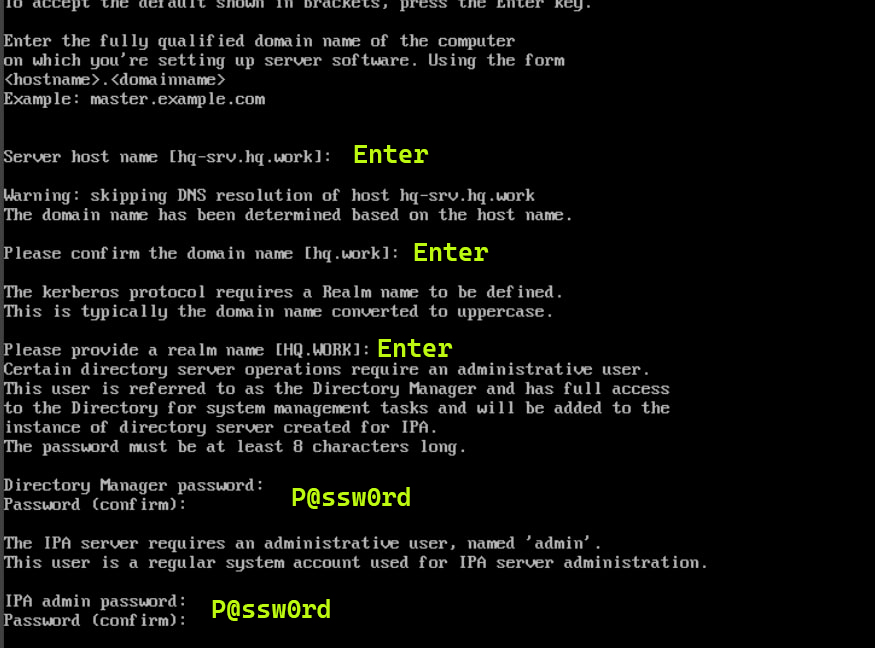

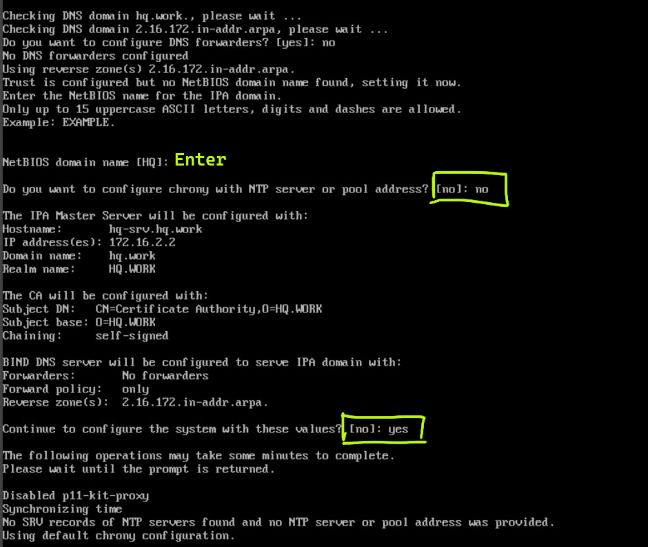

</br>

> Примечание: установка FreeIPA достаточно продолжительная, поэтому рекомендуем пока она качается поделать другую часть задания, чтобы не терять время

</br>

Если после установки вылезло сообщение с портами, значит установка FreeIPA прошла успешно.

</br>

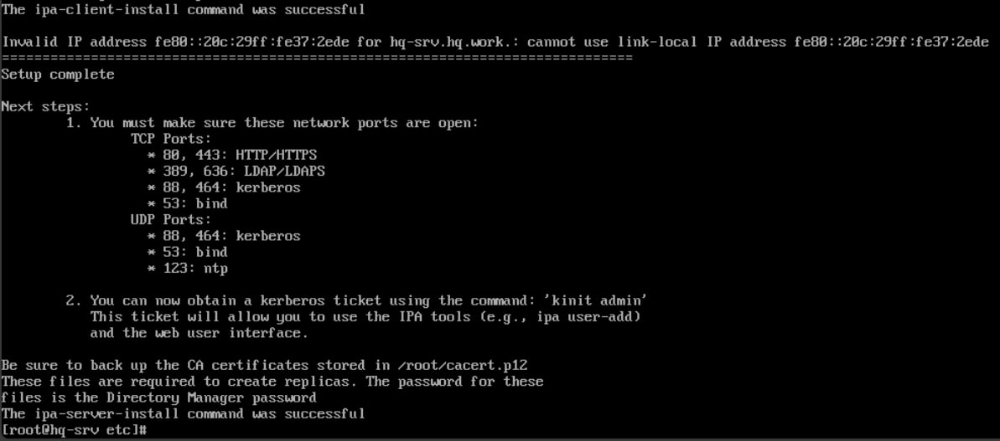

</br>

Не забываем проверить выключен ли **firewalld**. Если включен - выключаем.

```console
[root@hq-srv ~]# systemctl status firewalld
[root@hq-srv ~]# systemctl stop firewalld
```

</br>

Теперь можем проверить корректность настройки FreeIPA при помощи команды **sudo ipactl status**. 

```console
[root@hq-srv ~]# sudo ipactl status
Directory Service: RUNNING
krb5kdc Service: RUNNING
kadmin Service: RUNNING
named Service: RUNNING
httpd Service: RUNNING
ipa-custodia Service: RUNNING
pki-tomcatd Service: RUNNING
ipa-otpd Service: RUNNING
ipa-dnskeysyncd Service: RUNNING
ipa: INFO: The ipactl command was successful
```

</br>

Также запрашиваем билет Kerberos для пользователя **admin** при помощи команды **kinit**. Запросит пароль, пишем P@ssw0rd.

```console
[root@hq-srv ~]# sudo kinit admin
Password for admin@HQ.WORK: 
```

</br>

Проверяем наличие билета при помощи команды **klist**.

```console
[root@hq-srv ~]# sudo klist
Ticket cache: KCM:0
Default principal: admin@HQ.WORK

Valid starting		Expires			    Service principal
11.05.2024 20:36:33	12.05.2024 19:41:03	krbtgt/HQ.WORK@HQ.WORK
```

</br>

Теперь залетаем на **CLI**. Ставим hostname с доменом при помощи **hostnamectl set-hostname**.

```console
root@CLI:~# hostnamectl set-hostname cli.hq.work
```

</br>

Редачим файл **/etc/hosts** и добавляем запись для **HQ-SRV**. Также добавляем запись **cli.hq.work** для локального адреса.

```console
root@CLI:~# nano /etc/hosts
```

```console
127.0.0.1 cli.hq.work localhost debian
127.0.1.1 cli.hq.work localhost debian

172.16.2.2 hq-srv.hq.work    hq-srv
```

</br>

Переименовываем **/etc/resolv.conf** в **/etc/resolv.conf.old**.

```console
root@CLI:~# mv /etc/resolv.conf /etc/resolv.conf.old
```

</br>

Создаем и редачим новый **/etc/resolv.conf**.

```console
root@CLI:~# nano /etc/resolv.conf
```

```console
nameserver 172.16.2.2
search hq.work
```

</br>

Проверяем доступность доменного имени **hq-srv.hq.work** при помощи пинга на **CLI**. Запросы должны быть успешными.

```console
root@CLI:~# ping hq-srv.hq.work
```

</br>

Скачиваем пакет **freeipa-client** на **CLI**. В процессе установки вас будут спрашивать какую-то хуйню, оставляем все по умолчанию и пустым.

```console
root@CLI:~# apt install freeipa-client
```

</br>

Добавляем клиента **CLI** в домен при помощи команды **ipa-client-install**.

```console
root@CLI:~# sudo ipa-client-install --mkhomedir --domain hq.work --realm HQ.WORK --enable-dns-updates
This program will set up IPA client.
Version 4.9.11
```

</br>

Процесс выполнения команды должен быть такой же, как на скрине ниже.


</br>

Заходим в браузер (в нашем случае это Firefox на CLI) и переходим по адресу https://hq-srv.hq.work/ipa/ui.


</br>

Вводим данные пользователя: имя **admin** и пароль **P@ssw0rd**.


</br>

Заходим в "Сетевые службы", затем в "DNS" - "Зоны DNS".

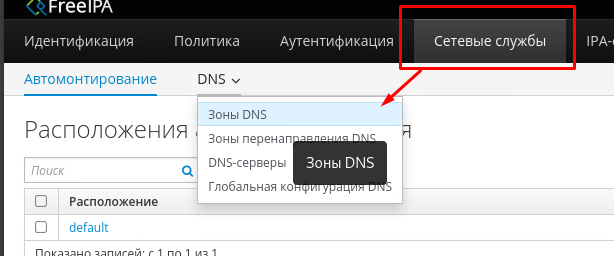

</br>

Добавляем новую зону прямую "branch.work" и обратную зону для подсети BRANCH (в нашем случае это 192.168.33.0/28). При создании прямой зоны нажмите на галочку **"Пропустить проверку пересечения"**.

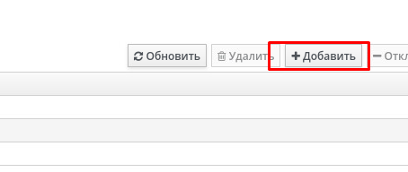

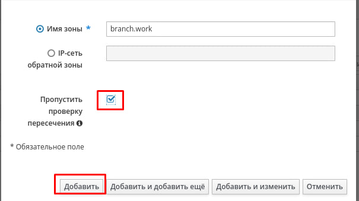

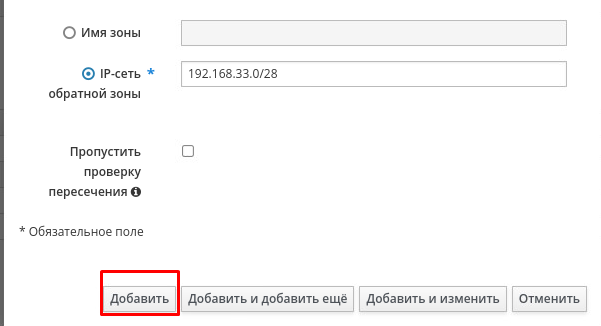

</br>

Создаем А-запись в прямой зоне "hq.work" для узла **HQ-R**. Не забываем нажать на галочку "Create reverse", чтобы сразу создать запись в обратной зоне. Для **HQ-SRV** и **CLI** записи у нас уже есть.


</br>

Аналогичным образом делаем А-записи для **BR-SRV** и **BR-R** в прямой зоне "branch.work".

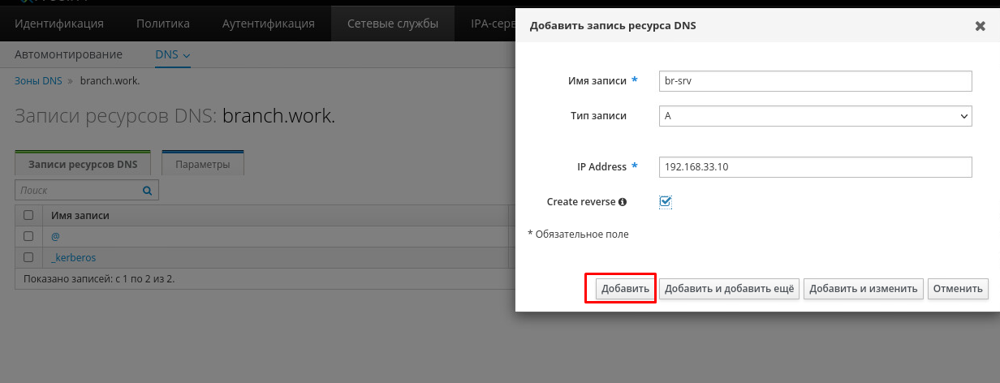

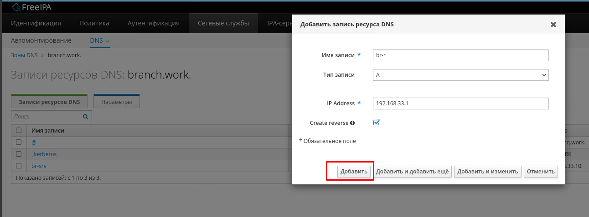

</br>

Теперь можно заняться добавлением **BR-SRV** в домен. Заходим и проделываем примерно такие же процедуры с файлом **/etc/resolv.conf**, что и на **CLI**.

```console
root@BR-SRV:~# mv /etc/resolv.conf /etc/resolv.conf.old
```

```console
root@BR-SRV:~# nano /etc/resolv.conf
```

```console
nameserver 172.16.2.2
search hq.work branch.work
domains hq.work branch.work
```

</br>

Редачим **/etc/hosts**, добавляем запись для **hq-srv.hq.work** и самого **br-srv.branch.work**.

```console
root@BR-SRV:~# nano /etc/hosts
```

```console
127.0.0.1 br-srv.branch.work localhost debian
127.0.1.1 br-srv.branch.work localhost debian

172.16.2.2 hq-srv.hq.work
```

</br>

Меняем hostname на **br-srv.branch.work** при помощи **hostnamectl**.

```console
root@BR-SRV:~# hostnamectl set-hostname br-srv.branch.work
```

</br>

Скачиваем пакет **freeipa-client**. Все оставляем по умолчанию и пустым.

```console
root@BR-SRV:~# apt install freeipa-client -y
```

</br>

Добавляем **BR-SRV** в домен при помощи команды **ipa-client-install**.

```console
root@BR-SRV:~# sudo ipa-client-install
```

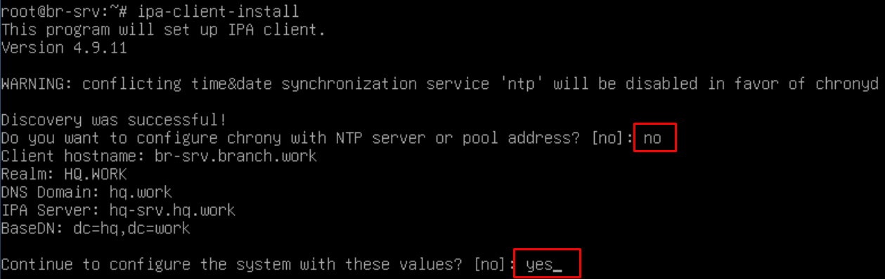

</br>

Вводим имя пользователя **admin** и пароль **P@ssw0rd**.


</br>

> BOMBACLAAT! RASTACLAAT! PUSSYCLAAT! Если вы сделали действия выше, обратитесь в Massachusetts Institute of Technology за дипломом

</br>

</details>

---

</br>

### <a id="module_2_2">2. Настройте синхронизацию времени между сетевыми устройствами по протоколу NTP. </a>

<details> <summary> Open me! </summary>

</br>

**2.1 Используйте Loopback интерфейс на HQ-R, как источник сервера времени.**

**2.2 Все остальные устройства и сервера должны синхронизировать свое время с роутером HQ-R.**

**2.3 Все устройства и сервера настроены на московский часовой пояс (UTC +3).**

</br>

Устанавливаем пакет *chrony* на **всех** устройствах (HQ-SRV, HQ-R, BR-SRV, BR-R, ISP, CLI).

```console
root@HQ-R:~# apt install chrony -y
```

</br>

Включаем автозапуск для службы *chrony*.

```console
root@HQ-R:~# systemctl enable chrony
```

</br>

> Примечание: служба на HQ-SRV называется chronyd.

</br>

Редактируем конфигурационный файл */etc/chrony/chrony.conf*.

```console
root@HQ-R:~# nano /etc/chrony/chrony.conf
```

```console
# Welcome to the chrony configuration file. See chrony.conf(5) for more
# information about usable directives.

server 127.0.0.1 prefer iburst

local stratum 5
manual
allow

# Include configuration files found in /etc/chrony/conf.d.
confdir /etc/chrony/conf.d

# Use Debian vendor zone.
# pool 2.debian.pool.ntp.org iburst

# Use time sources from DHCP
# sourcedir /run/chrony-dhcp

# Use NTP sources found in /etc/chrony/sources.d.
# sourcedir /etc/chrony/sources.d

# This directive specify the location of the file containing ID/key pairs for
# NTP authentication.
# keyfile /etc/chrony/chrony.keys

# This directive specify the file into which chronyd will store the rate
# information.
driftfile /var/lib/chrony/chrony.drift
...
```

</br>

Устанавливаем московский часовой пояс (UTC +3) на **всех** устройствах.

```console
root@HQ-R:~# timedatectl set-timezone Europe/Moscow
```

</br>

Приводим конфигурационный файл */etc/chrony/chrony.conf* на всех остальных устройствах к следующему виду (HQ-SRV, BR-R, BR-SRV, ISP, CLI).

```console
root@BR-R:~# nano /etc/chrony/chrony.conf
```

```console
# Welcome to the chrony configuration file. See chrony.conf(5) for more
# information about usable directives.

server 172.16.2.1 prefer iburst

# Include configuration files found in /etc/chrony/conf.d.
confdir /etc/chrony/conf.d

# Use Debian vendor zone.
# pool 2.debian.pool.ntp.org iburst

# Use time sources from DHCP
# sourcedir /run/chrony-dhcp

# Use NTP sources found in /etc/chrony/sources.d.
# sourcedir /etc/chrony/sources.d

# This directive specify the location of the file containing ID/key pairs for
# NTP authentication.
# keyfile /etc/chrony/chrony.keys

# This directive specify the file into which chronyd will store the rate
# information.
driftfile /var/lib/chrony/chrony.drift
...
```

</br>

> Примечание: путь к chrony.conf на HQ-SRV выглядит как /etc/chrony.conf.

</br>

Перезагружаем службу *chrony* на **всех устройствах**.

```console
root@HQ-R:~# systemctl restart chrony
```

</br>

Проверить работу NTP на клиентах можно при помощи команды **chronyc sources**.


</br>

Проверить же, подключены ли клиенты к NTP-серверу на **HQ-R** можно при помощи команды **chronyc clients**.


</br>

</details>

---

</br>

### <a id="module_2_3">3. Настройте сервер домена выбор, его типа обоснуйте, на базе HQ-SRV через web интерфейс, выбор технологий обоснуйте. </a>

<details> <summary> Open me! </summary>

</br>

**3.1 Введите машины BR-SRV и CLI в данный домен**

</br>

Мы уже настроили сервер домена **FreeIPA** в самом [начале](#module_2_1) этого модуля, без него бы не получилось бы настроить DNS. Поэтому едем дальше.

</br>

</details>

---

</br>

### <a id="module_2_4">4. Реализуйте файловый SMB или NFS (выбор обоснуйте) сервер на базе сервера HQ-SRV. </a>

<details> <summary> Open me! </summary>

</br>

**4.1. Должны быть опубликованы общие папки по названиям:**

**i. Branch_Files — только для пользователя Branch admin;**

**ii. Network — только для пользователя Network admin;**

**iii. Admin_Files — только для пользователя Admin;**

**4.2. Каждая папка должна монтироваться на всех серверах в папку /mnt/ (например, /mnt/All_files) автоматически при входе доменного пользователя в систему и отключаться при его выходе из сессии. Монтироваться должны только доступные пользователю каталоги.**

</br>

Первым делом необходимо создать доменных пользователей: **network-admin** и **branch-admin**. Пользователь **admin** у нас уже имеется. Пароль всем назначаем: **P@ssw0rd**.


</br>

Далее переходим в "IPA-сервер" - "Разрешения". Нажимаем "Добавить".


</br>

Имя для разрешения указываем любое. **Тип правила привязки**: permission. **Предоставленные права**: read, search, compare. **Тип**: "пользователь". **Действующие атрибуты**: ipantsecurityidentifier, ipanthash.


</br>

Теперь переходим в "IPA-сервер" - "Привилегии". Добавляем новую привилегию. Имя для привилегии указываем любое.

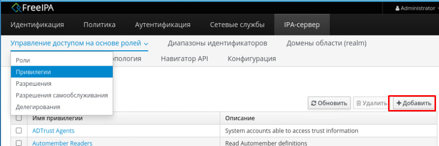

</br>

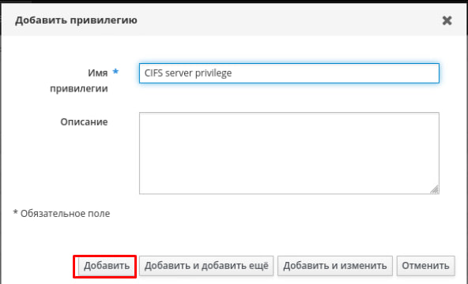

</br>

Теперь переходим в созданную привилегию (нажав на ее название в списке). Нажимаем "Разрешения", затем "Добавить".

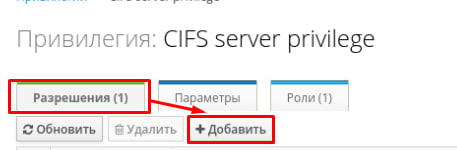

</br>

В поле для ввода пишем часть названия вашего разрешения, жмем "Фильтр". Затем выбираем разрешение и жмем на "**>**". После жмем "Добавить".


</br>

Переходим в "IPA-сервер" - "Роли". Жмем "Добавить".


</br>

Называем роль как хотим, жмем "Добавить".


</br>

Нажимаем на имя роли в списке ролей, жмем на "Привилегии" - "Добавить".

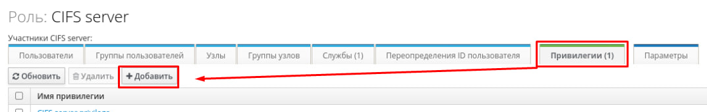

</br>

Находим нашу созданную привилегию и добавляем в роль.

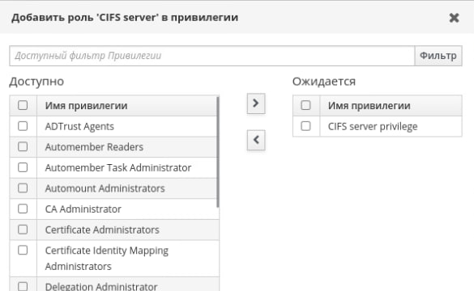

</br>

Переходим в "Идентификация" - "Службы". Жмем "Добавить".


</br>

Служба - "**cifs**". Имя узла - "**hq-srv.hq.work**". Не забываем нажать галочку "Принудительно".

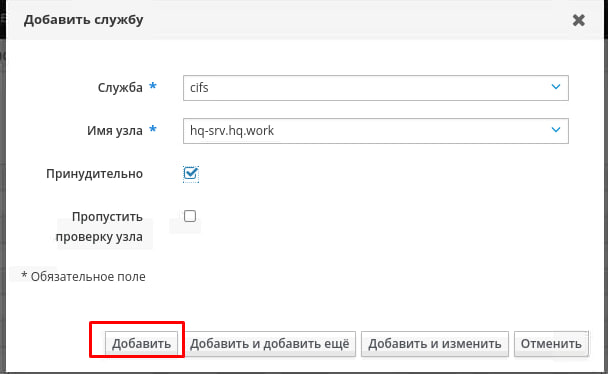

</br>

Заходим в саму службу, нажав на ее имя в списке. Жмем "Роли" - "Добавить".

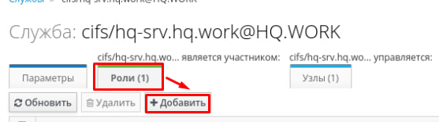

</br>

Добавляем службу в ранее созданную роль.


</br>

Также скачиваем пакет **ipa-server-trust-ad** и вводим команду ipa-adtrust-install --add-sids.

```console
[root@hq-srv ~]# dnf -y install freeipa-server-trust-ad
[root@hq-srv ~]# ipa-adtrust-install --add-sids
```

</br>

В ходе выполнения команды вводим пароль, затем пишем "yes", затем пишем "no".


</br>

Создаем три директории - **/srv/Admin_Files**, **/srv/Network**, **/srv/Branch_Files**. 

```console
[root@hq-srv ~]# mkdir /srv/Admin_Files
[root@hq-srv ~]# mkdir /srv/Network
[root@hq-srv ~]# mkdir /srv/Branch_Files
```

</br>

На минутку надо вернуться в веб-интерфейс FreeIPA. Открываем список пользователей и смотрим их **UID**. Их надо запомнить или записать.


</br>

Теперь выдаем права при помощи команды **chown** доменным пользователям при помощи указания их UID.

```console
[root@hq-srv ~]# chown 1113000000:11130000000 /srv/Admin_Files
[root@hq-srv ~]# chown 1113000004:11130000004 /srv/Branch_Files
[root@hq-srv ~]# chown 1113000003:11130000003 /srv/Network
```

</br>

Также выставляем привилегии при помощи команды **chmod** на все содержимое директории /srv.

```console
[root@hq-srv ~]# chmod 700 /srv/*
```

</br>

По итогу содержимое директории **/srv** должно выглядеть так.


</br>

Открываем и редактируем конфиг **Samba** - /etc/samba/smb.conf. Приводим его к следующему виду.

```console
[root@hq-srv ~]# vim /etc/samba/smb.conf
```

```console
[global]
state directory = /var/lib/samba
cache directory = /var/lib/samba
include = registry

workgroup = HQ
realm = HQ.WORK
security = USER

[Admin_Files]
path = /srv/Admin_Files
valid users = admin@HQ.WORK
browseable = yes
read only = no

[Network]
path = /srv/Network
valid users = network-admin@HQ.WORK
browseable = yes
read only = no

[Branch_Files]
path = /srv/Branch_Files
valid users = branch-admin@HQ.WORK
browseable = yes
read only = no
```

</br>

Запускаем и включаем автозапуск службы **smb**.

```console
[root@hq-srv ~]# systemctl restart smb
[root@hq-srv ~]# systemctl enable smb
```

</br>

Скачиваем пакет **samba-client** на **HQ-SRV**, **CLI**, **BR-SRV**.

```console
[root@hq-srv ~]# dnf -y install samba-client
```

```console
root@br-srv:~# apt install samba-client -y
root@cli:~# apt install samba-client -y
```

</br>

Проверяем подключение к папке за доменного пользователя. Например, ниже показано подключение за пользователя admin@HQ.WORK к папке "**Admin_Files**".

```console
[root@hq-srv ~]# smbclient -U admin@HQ.WORK //hq-srv.hq.work/Admin_Files
Password for [admin@HQ.WORK]:
Try "help" to get a list of possible commands.
smb: \>
```

</br>

Проверьте аналогичным образом подключение на **BR-SRV**.

```console
root@BR-SRV:~# smbclient -U admin@HQ.WORK //hq-srv.hq.work/Admin_Files
Password for [admin@HQ.WORK]:
Try "help" to get a list of possible commands.
smb: \>
```

</br>

Теперь можно перейти к настройке автомонтирования. Скачиваем на **HQ-SRV**, **BR-SRV** и **CLI** пакеты **autofs** и **cifs-utils**.

```console
root@BR-SRV:~# apt install autofs cifs-utils -y
```

```console
root@CLI:~# apt install autofs cifs-utils -y
```

```console
[root@hq-srv ~]# dnf -y install autofs cifs-utils
```

</br>

Переходим в веб-интерфейс FreeIPA. Переходим в "Сетевые службы" - "Автомонтирование". Затем открываем расположение "default".


</br>

Открываем список автомонтирования "auto.direct".


</br>

Создаем три ключа автомонтирования со следующими параметрами:

| Ключ                        | Сведения автомонтирования                               |
| --------------------------- | ------------------------------------------------------- |
| /srv/All_Files/Admin_Files  | -fstype=cifs,rw,noperm,credentials=/root/.admin         |
| /srv/All_Files/Network      | -fstype=cifs,rw,noperm,credentials=/root/.network-admin |
| /srv/All_Files/Branch_Files | -fstype=cifs,rw,noperm,credentials=/root/.branch-admin  |

</br>


</br>

На **BR-SRV**, **CLI**, **BR-SRV** создаем три файла в директории **/root**:

```console
cd /root
touch .admin
touch .network-admin
touch .branch-admin
```

</br>

Редактируем файлы. Указываем имя пользователя, пароль и домен.

```console
nano .admin
```

```console
username=admin
password=P@ssw0rd
domain=HQ.WORK
```

</br>

```console
nano .branch-admin
```

```console
username=branch-admin
password=P@ssw0rd
domain=HQ.WORK
```

</br>

```console
nano .network-admin
```

```console
username=network-admin
password=P@ssw0rd
domain=HQ.WORK
```

</br>

На **HQ-SRV**, **CLI** и **BR-SRV** вводим команду **sudo ipa-client-automount --location=default**. Когда просят что-то написать, пишем **yes**.

```console
sudo ipa-client-automount --location=default
```


</br>

Перезагружаем **CLI**, **HQ-SRV**, **BR-SRV**.

```console
reboot now
```

</br>

Проверяем работу **smb** на **HQ-SRV**. Если он лежит - перезапускаем - **systemctl restart smb**.

```console
[root@hq-srv ~]# systemctl status smb
[root@hq-srv ~]# systemctl restart smb
```

</br>

Затем переходим в директорию **/srv/** на **CLI** или **BR-SRV** и видим наличие директории **All_Files**. В ней же лежат директории **Network**, **Admin_Files**, **Branch_Files**.

```console
root@CLI:~# cd /srv
root@CLI:/srv# cd All_Files
root@CLI:/srv/All_Files# ls -la
итого 8
drwxr-xr-x 5 root root 4096 мая 27 03:30 .
drwxr-xr-x 3 root root 4096 мая 27 02:37 ..
drwxr-xr-x 2 root root    0 мая 27 03:30 Admin_Files
drwxr-xr-x 2 root root    0 мая 24 01:07 Branch_Files
drwxr-xr-x 2 root root    0 мая 24 01:07 Network
```

</br>

Попробуем перейти в директорию **Admin_Files** и создать в ней файл **test**.

```console
root@CLI:/srv/All_Files# cd Admin_Files
root@CLI:/srv/All_Files/Admin_Files# touch test
```

</br>

После создания файла он должен появиться в директории **/srv/Admin_Files** на **HQ-SRV**.

```console
root@hq-srv:/srv/Admin_Files# ls -la
итого 0
drwxr-xr-x. 2 admin admins  18 мая 27 03:50 .
drwxr-xr-x. 5 root  root   151 мая 24 06:02 ..
-rwxr--r--. 1 admin admins   0 мая 27 03:50 test
```

</br>

> Примечание: если после перехода в директории Admin_Files, Branch_Files, Network, вам пишут что "такой директории не существует", значит скорее всего вы где-то накосячили с файлами /root/.admin, /root/.branch-admin, /root/.network-admin

</br>

</details>

---

</br>

### <a id="module_2_5">5. Сконфигурируйте веб-сервер LMS Apache на сервере BR-SRV. </a>

<details> <summary> Open me! </summary>

</br>

**5.1. На главной странице должен отражаться номер места.**

**5.2. Используйте базу данных mySQL.**

**5.3. Создайте пользователей в соответствии с таблицей, пароли у всех пользователей «P@ssw0rd».**

</br>

| Пользователь | Группа  |
|--------------|---------|
| Admin        | Admin   |
| Manager1     | Manager |
| Manager2     | Manager |
| Manager3     | Manager |
| User1        | User    |
| User2        | User    |
| User3        | User    |
| User4        | User    |
| User5        | User    |
| User6        | User    |
| User7        | User    |

</br>

Скачиваем пакет **apache2** на **BR-SRV**.

```console
root@BR-SRV:~# apt install apache2
```

</br>

Опустошаем файл **/var/www/html/index.html**.

```console
root@BR-SRV:~# echo "" > /var/www/html/index.html
```

</br>

Редактируем файл **/var/www/html/index.html**. Внутри тега "span" должен быть номер вашего рабочего места.

```console
root@BR-SRV:~# nano /var/www/html/index.html
```

```console
<html>
<head>
	<meta charset='utf-8'>
	<title> DEMO </title>
</head>
<body>
	<span> 14 </span>
</body>
</html>
```

</br>

Переходим по IP-адресу **BR-SRV** и видим страничку.

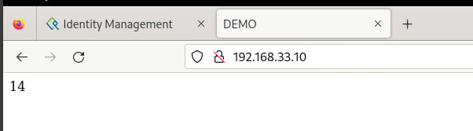

</br>

Скачиваем пакет **mariadb-server**.

```console
root@BR-SRV:~# apt install mariadb-server -y
```

</br>

Логинимся за юзера **root** в **mysql**. Пароль - **пустой**, просто жмем Enter.

```console
root@BR-SRV:~# mysql -u root -p
Enter password: 
```

</br>

Пишем SQL-запросы на создание пользователей.

```console
CREATE USER "Admin"@"localhost" IDENTIFIED BY "P@ssw0rd";
CREATE USER "Manager1"@"localhost" IDENTIFIED BY "P@ssw0rd";
CREATE USER "Manager2"@"localhost" IDENTIFIED BY "P@ssw0rd";
CREATE USER "Manager3"@"localhost" IDENTIFIED BY "P@ssw0rd";
CREATE USER "User1"@"localhost" IDENTIFIED BY "P@ssw0rd";
CREATE USER "User2"@"localhost" IDENTIFIED BY "P@ssw0rd";
CREATE USER "User3"@"localhost" IDENTIFIED BY "P@ssw0rd";
CREATE USER "User4"@"localhost" IDENTIFIED BY "P@ssw0rd";
CREATE USER "User5"@"localhost" IDENTIFIED BY "P@ssw0rd";
CREATE USER "User6"@"localhost" IDENTIFIED BY "P@ssw0rd";
CREATE USER "User7"@"localhost" IDENTIFIED BY "P@ssw0rd";
```

</br>

Удалить случайно созданного пользователя можно следующей командой:

```console
DROP USER "User"@"localhost";
```

</details>

---

</br>

### <a id="module_2_6">6. Запустите сервис MediaWiki используя docker на сервере HQ-SRV. </a>

<details> <summary> Open me! </summary>

</br>

6.1. Установите Docker и Docker Compose.

6.2. Создайте в домашней директории пользователя файл wiki.yml для приложения MediaWiki:

6.2.1. Средствами docker compose должен создаваться стек контейнеров с приложением MediaWiki и базой данных

6.2.2. Используйте два сервиса; 

6.2.3. Основной контейнер MediaWiki должен называться wiki и использовать образ mediawiki; 

6.2.4. Файл LocalSettings.php с корректными настройками должен находиться в домашней папке пользователя и автоматически монтироваться в образ;  

6.2.5. Контейнер с базой данных должен называться db и использовать образ mysql;

6.2.6. Он должен создавать базу с названием mediawiki, доступную по стандартному порту, для пользователя wiki с паролем DEP@ssw0rd; 

6.2.7. База должна храниться в отдельном volume с названием dbvolume.  
MediaWiki должна быть доступна извне через порт 8080.

</br>

Скачиваем пакеты **docker** и **docker-compose** на **HQ-SRV**.

```console
[root@hq-srv ~]# dnf -y install docker docker-compose
```

</br>

Включаем службу **docker** и добавляем ее в автозапуск.

```console
[root@hq-srv ~]# systemctl start docker
[root@hq-srv ~]# systemctl enable docker
```

</br>

Создаем файл **wiki.yml** в домашней директории пользователя.

```console
[root@hq-srv ~]# touch /home/adminn/wiki.yml
```

</br>

Создаем папку **images** в домашней директории пользователя.

```console
[root@hq-srv /home/adminn]# mkdir images
```

</br>

Создаем volume **dbvolume** при помощи команды **docker volume create**.

```console
[root@hq-srv ~]# docker volume create dbvolume
```

</br>

Редактируем файл **wiki.yml** и создаем необходимые сервисы.

```console
[root@hq-srv /home/adminn/]# nano wiki.yml
```

```console
version: '3'
services:
  MediaWiki:
    image: mediawiki
    container_name: wiki
    restart: always
    ports:
      - 8080:80
    volumes:
      - ./images:/var/www/html/images
    depends_on:
      - database
  database:
     image: mysql
     container_name: db
     environment:
       MYSQL_DATABASE: mediawiki
       MYSQL_USER: wiki
       MYSQL_PASSWORD: DEP@ssw0rd
       MYSQL_RANDOM_ROOT_PASSWORD: 'yes'
    volumes:
       - dbvolume:/var/lib/mysql
volumes:
  dbvolume:
    external: true
```

</br>

При попытке запустить docker-compose вылетит ошибка о том, что 8080 порт уже используется. Поэтому надо исправить этот момент.

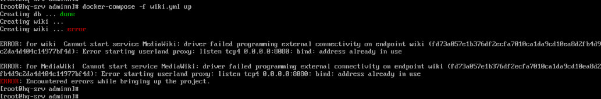

</br>

Чтобы открыть 8080 порт, нужно открыть файл **/etc/tomcat/server.xml** и найти вот эту часть конфига.

```console
<Connector port="8080" protocol="HTTP/1.1"
connectionTimeout="20000"
redirectPort="8443"
maxParameterCount="1000"
/>
```

</br>

Затем закомментить ее следующим образом:

```console
<!--
<Connector port="8080" protocol="HTTP/1.1"
connectionTimeout="20000"
redirectPort="8443"
maxParameterCount="1000"
/>
-->
```

</br>

Выключаем службу **pki-tomcatd@pki-tomcat** и убираем ее из автозапуска.

```console
[root@hq-srv ~]# systemctl stop pki-tomcatd@pki-tomcat
[root@hq-srv ~]# systemctl disable pki-tomcatd@pki-tomcat
```

</br>

Затем делаем reboot системы.

```console
[root@hq-srv ~]# reboot now
```

</br>

Теперь можно поднимать сервисы при помощи команды **docker-compose up**. Не забываем также указать имя файла.

```console
[root@hq-srv /home/adminn]# docker-compose -f wiki.yml up
```

</br>

Переходим по IP-адресу **HQ-SRV** и порту 8080 в браузере (hq-srv.hq.work:8080). Появится логотип MediaWiki и кликабельная подпись внизу, тыкаем на нее.

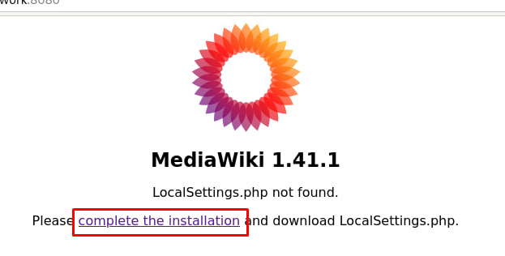

</br>

Начнется установка MediaWiki. Оставляем русский язык по умолчанию и жмем "Далее".


</br>

Следующий этап установки - соединение с сервером БД. Указываем в качестве хоста имя контейнера - "**db**". Имя базы данных - "**mediawiki**".


</br>

Имя пользователя базы данных - "**wiki**". Пароль базы данных - "**DEP@ssw0rd**".

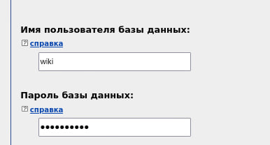

</br>

На следующем этапе ставим галочку и жмем "Далее".

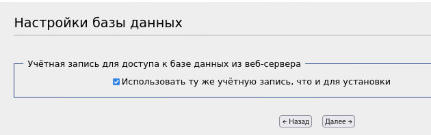

</br>

На следующем этапе указываем любое название вики.

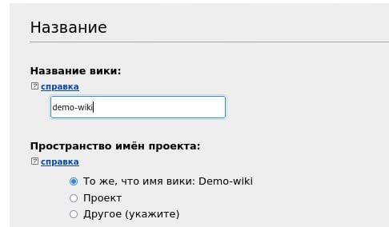

</br>

Имя участника - **admin**. Пароль - "**DEP@ssw0rd**". Адрес электронной почты - желательно ваш мптшный.

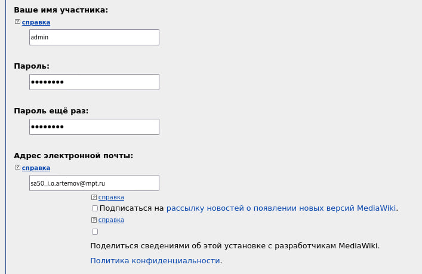

</br>

В самом низу жмем галочку "Хватит, установить вики". А то уже заебали внатуре. Жмем "Далее".

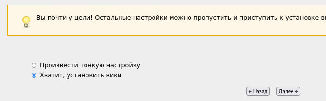

</br>

Далее жмем "Далее".

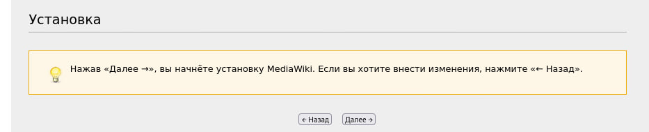

</br>

Видим, что все выполнено, и жмем "Далее". Вот бы всю демку просто "Далее" хуячить


</br>

Свершилось - получаем на выходе установку файла **LocalSettings.php**.


</br>

Смотрим, где он лежит. Для удобства рекомендую перенести его из "Загрузки" в домашнюю директорию (/home/adminn), чтобы лишний раз не менять раскладку.


</br>

Возвращаемся в терминал **HQ-SRV**. Подключаемся по sftp к **CLI**, и скачиваем файл через команду **get** в домашнюю директорию (/home/adminn).

```console
[root@hq-srv ~]# sftp adminn@192.168.100.100
Connected to 192.168.100.100.
sftp>
sftp> get LocalSettings.php /home/adminn/LocalSettings.php
sftp> exit
```

</br>

Меняем файл **wiki.yml**. Добавляем новый volume для сервиса MediaWiki: пробрасываем файл **LocalSettings.php** по пути **/var/www/html/LocalSettings.php**.

```console
[root@hq-srv /home/adminn]# nano wiki.yml
```

```console
...
      - 8080:80
    volumes:
      - ./images:/var/www/html/images
      - ./LocalSettings.php:/var/www/html/LocalSettings.php
    depends_on:
...
```

</br>

Опускаем и поднимаем docker-compose (мне обычный restart не помог).

```console
[root@hq-srv /home/adminn]# docker-compose -f wiki.yml down
[root@hq-srv /home/adminn]# docker-compose -f wiki.yml up
```

</br>

Снова переходим на 8080 порт **HQ-SRV** (hq-srv.hq.work:8080) и видим, что MediaWiki работает.


</br>

</details>

---

</br>


## <a id="module_3">Модуль 3. Эксплуатация объектов сетевой инфраструктуры. </a>

</br>

### <a id="module_3_1">1. Реализуйте мониторинг по средствам rsyslog на всех Linux хостах. </a>

<details> <summary> Open me! </summary>

</br>

**1.1 Составьте отчёт о том, как работает мониторинг.**

</br>

Устанавливаем пакет **rsyslog** на все тачки.

```console
apt install rsyslog-* -y
```

Также на **HQ-SRV**.

```
dnf -y install rsyslog-*
```

</br>

Во время установки пакетов везде жмем "Нет".


</br>

Включаем автозапуск службы и стартуем ее.

```console
systemctl start rsyslog
systemctl enable rsyslog
```

</br>

В качестве центрального сервера, который будет принимать логи с остальных устройств, будет выступать **HQ-SRV**.

</br>

Редактируем на **HQ-SRV** файл **/etc/rsyslog.conf**.

```console
[root@hq-srv ~]# nano /etc/rsyslog.conf
```

</br>

Расскоменчиваем эти параметры.

```console
...
# provides UDP syslog reception
module(load="imudp")
input(type="imudp" port="514")

# provides TCP syslog reception
module(load="imtcp")
input(type="imtcp" port="514")
...
```

</br>

В самом конце файла пишем следующую ебанину (да, выглядит страшно, но так надо)

```console
$template RemoteLogs, "/var/log/rsyslog/%HOSTNAME%/%PROGRAMNAME%"
*.* ?RemoteLogs
& ~
```

</br>

Перезагружаем службу **rsyslog** на **HQ-SRV**.

```console
[root@hq-srv ~]# systemctl restart rsyslog
```

</br>

На всех остальных машинах под управлением Debian создаем файл **/etc/rsyslog.d/all.conf**.

```console
touch /etc/rsyslog.d/all.conf
```

</br>

Редактируем его и пишем там следующее (в качестве IP-адреса указывается IP-адрес **HQ-SRV**).

```console
nano /etc/rsyslog.d/all.conf
```

```console
*.* @@172.16.2.2:514
```

</br>

Перезагружаем на всех машинах под управлением Debian службу **rsyslog**.

```console
systemctl restart rsyslog
```

</br>

Переходим на **HQ-SRV** по пути **/var/log/rsyslog/** и видим директории для каждого узла. Внутри них лежат логи от приложений.

```console
cd /var/log/rsyslog
```

</br>


</details>

---

</br>

### <a id="module_3_2">2. Выполните настройку центра сертификации на базе HQ-SRV. </a>

<details> <summary> Open me! </summary>

</br>

**2.1. Выдайте сертификаты для SSH;**

**2.2. Выдайте сертификаты для веб серверов;**

</br>

Скачиваем пакет **easy-rsa** на **HQ-SRV**.

```console
[root@hq-srv ~]# dnf -y install easy-rsa
```

</br>

Копируем файл **easyrsa** в домашнюю директорию пользователя.

```console
[root@hq-srv ~]# cp /usr/share/easy-rsa/3.1.7/easy-rsa /home/adminn/easy-rsa
```

</br>

Переходим в домашнюю директорию пользователя и вводим команду **init-pki**, инициализируя инфраструктуру ключей.

```console
[root@hq-srv ~]# cd /home/adminn
[root@hq-srv adminn]# ./easyrsa init-pki
```

</br>

Создаем ЦС командой **build-ca**.

```console
[root@hq-srv adminn]# ./easyrsa build-ca
```

</br>

В ходе выполнения команды **build-ca** попросят ввести Passphrase, пустым его оставить нельзя, поэтому вводим **P@ssw0rd**. Также нас спросят Common Name, вводим **hq-srv.hq.work**.


</br>

Генерируем запрос на подпись сертификата для **BR-SRV**. Common Name оставляем по умолчанию (br-srv.branch.work).

```console
[root@hq-srv adminn]# ./easyrsa gen-req br-srv.branch.work nopass
```

</br>


</br>

Создаем сам сертификат для **BR-SRV**. На моменте "Confirm request details" вводим **yes**, на моменте "Enter pass phrase" вводим **P@ssw0rd**.

```console
[root@hq-srv adminn]# ./easyrsa sign-req server br-srv.branch.work
```

</br>


</br>

Теперь необходимо перекинуть сертификат на **BR-SRV**. Подключаемся по sftp на **BR-SRV** с **HQ-SRV**.

```console
[root@hq-srv adminn]# sftp -P 2222 branch-admin@192.168.33.10
Connected to 192.168.33.10.
sftp>
```

</br>

Перекидываем два файла через **put** - приватный ключ и сертификат.

```console
sftp> put /home/adminn/pki/issued/br-srv.branch.work.crt
sftp> put /home/adminn/pki/private/br-srv.branch.work.key
```

</br>

Переходим на **BR-SRV**. Редактируем конфигурационный файл **/etc/apache2/sites-available/default-ssl.conf**.

```console
root@BR-SRV:~# nano /etc/apache2/default-ssl.conf
```

</br>

Находим две строчки: **SSLCertificateFile** и **SSLCertificateKeyFile**. Пишем там пути к сертификату и ключу.

```console
...
SSLCertificateFile /home/branch-admin/br-srv.branch.work.crt
SSLCertificateKeyFile /home/branch-admin/br-srv.branch.work.key
...
```

</br>

Включаем модуль **ssl** для apache при помощи команды **a2enmod ssl**.

```console
root@BR-SRV:~# sudo a2enmod ssl
```

</br>

Включаем сайт **default-ssl** при помощи команды **a2ensite**.

```console
root@BR-SRV:~# sudo a2ensite default-ssl
```

</br>

Перезапускаем службу **apache2**.

```console
root@BR-SRV:~# systemctl restart apache2
root@BR-SRV:~# systemctl reload apache2
```

</br>

Заходим в браузер по IP-адресу **br-srv.branch.work** с использованием **https**.


</br>

Тыкаем на замочек, затем "Подробнее".


</br>

Видим всю инфу о сертификате и ЦС.


</details>

---

</br>

### <a id="module_3_3">3. Настройте SSH на всех Linux хостах. </a>

<details> <summary> Open me! </summary>

</br>

**3.1. Banner ( Authorized access only! );** 

**3.2. Установите запрет на доступ root;**

**3.3. Отключите аутентификацию по паролю;**

**3.4. Переведите на нестандартный порт;**

**3.5. Ограничьте ввод попыток до 4;**

**3.6. Отключите пустые пароли;**

**3.7. Установите предел времени аутентификации до 5 минут;** 

**3.8 Установите авторизацию по сертификату выданным HQ-SRV;**

</br>

На всех устройствах в домашних директориях пользователей должна быть директория **.ssh**. Если ее нет - необходимо ее создать, а также выставить права 700. Также директория должна быть создана от имени самого пользователя, которому принадлежит домашняя директория.

```console
[adminn@hq-srv ~]# mkdir /home/adminn/.ssh
[adminn@hq-srv ~]# chmod 700 /home/adminn/.ssh
```


</br>

При помощи **ssh-keygen** генерим пару ключей на **HQ-SRV**. Опять-таки от имени пользователя. Passhprase - пустой. Имя оставляем по умолчанию - id_rsa.

```console
[adminn@hq-srv ~]# cd .ssh
[adminn@hq-srv .ssh]# ssh-keygen
Enter file in which to save the key (/home/adminn/.ssh/id_rsa): 
Generating public/private rsa key pair.
Enter passphrase (empty for no passphrase):
Enter same passphrase again:
Your identification has been saved in demo_key
Your public key has been saved in demo_key.pub
```

</br>

Передаем с **HQ-SRV** публичный ключ на **BR-SRV**, **BR-R**, **HQ-R**.

```console
[adminn@hq-srv .ssh]# ssh-copy-id -i id_rsa.pub branch-admin@192.168.33.10
[adminn@hq-srv .ssh]# ssh-copy-id -i id_rsa.pub branch-admin@192.168.33.1
[adminn@hq-srv .ssh]# ssh-copy-id -i id_rsa.pub adminn@172.16.2.1
```

</br>

Открываем и редактируем конфиг SSH **/etc/ssh/sshd_config** на всех устройствах.

```console
nano /etc/ssh/sshd_config
```

```
Banner /etc/ssh/banner
Port 2222
LoginGraceTime 5m
PermitRootLogin no
MaxAuthTries 4
PubkeyAuthentication yes
PasswordAuthentication no
PermitEmptyPasswords no
```

</br>

Создаем и редактируем везде файл **/etc/ssh/banner**.

```console
touch /etc/ssh/banner
nano /etc/ssh/banner
```

```console
Authorized access only!
```

</br>

Перезагружаем службу **sshd** на всех устройствах.

```console
systemctl restart sshd
```

</br>

Проверяем подключение. Оно должно происходить автоматически, без запроса пароля, а также с появлением сообщения "Authorized access only!". Не забываем также указать порт.

```console
[adminn@hq-srv ~]# ssh -p 2222 adminn@172.16.2.1 
[adminn@hq-srv ~]# ssh -p 2222 branch-admin@192.168.33.1 
[adminn@hq-srv ~]# ssh -p 2222 branch-admin@192.168.33.10 
```

</br>


</details>

---

</br>

### <a id="module_3_4">4. Реализуйте антивирусную защиту по средствам ClamAV на устройствах HQ-SRV и BR-SRV. </a>

<details> <summary> Open me! </summary>

</br>

**4.1. Настройте сканирование системы раз в сутки с сохранением отчёта**

**4.2. Учтите, что сканирование должно проводится при условии, что от пользователей нет нагрузки**

</br>

Скачиваем на **HQ-SRV** пакеты **clamav**, **clamd**, **clamav-update**.

```console
[root@hq-srv ~]# dnf -y install clamav clamd clamav-update
```

</br>

На **BR-SRV** скачиваем просто один пакет **clamav**.

```console
root@BR-SRV:~# apt install clamav -y 
```

</br>

Открываем конфиг файл **freshclam.conf** на **HQ-SRV** и **BR-SRV**.

```console
[root@hq-srv ~]# nano /etc/freshclam.conf
```

```console
root@BR-SRV:~# nano /etc/clamav/freshclam.conf
```

</br>

На **BR-SRV** надо дать доступ для записи на этот файл.

```console
root@BR-SRV:~# chmod +w /etc/clamav/freshclam.conf
```

</br>

Находим строчку **"DatabaseMirror"** и меняем ее значение на https://clamav-mirror.ru. Если строчки две - оставляем одну.

```console
...
DatabaseMirror https://clamav-mirror.ru
...
```

</br>

Пробуем обновить БД ClamAV при помощи команды **freshclam**.

```console
freshclam
```

</br>

Если выскакивают ошибки по типу "CDN", делаем следующее. Если ошибок нет, едем дальше.

```console
mv /var/lib/clamav/freshclam.dat /var/lib/clamav/freshclam.dat.old
```

</br>

После этого снова пробуем выполнить обновление командой **freshclam**.

</br>

После успешного обновления, создаем скрипт **/opt/clamscan_home.sh**, а также файл **/var/log/clamscan_home.log**

```console
touch /opt/clamscan_home.sh
chmod +x clamscan_home.sh
touch /var/log/clamscan_home.log
```

</br>

Редактируем **clamscan_home.sh**.

```console
nano /opt/clamscan_home.sh
```

```console
#!/bin/bash
clamscan -i -r /home/ >> /var/log/clamscan_home.log
```

</br>

Проверяем выполнение скрипта его запуском. 

```console
/opt/clamscan_home.sh
```

</br>

> Примечание: выполнение скрипта в среднем занимает 2 минуты, если вы хотите ускорить этот процесс, попробуйте поменять директорию /home/ в скрипте на другую, где поменьше файлов.

</br>

Файл с логами после выполнения скрипта не должен быть пустым.

```console
cat /var/log/clamscan_home.log
```

</br>

Теперь делаем запуск скрипта каждый день. Пишем **crontab -e**. Выбираем редактор nano (1).

```console
crontab -e
```

</br>

> Примечание: на HQ-SRV чтобы открыть crontab с nano, пишем "EDITOR=nano crontab -e"

</br>

В конце файла пишем следующую строчку. Она означает запуск скрипта каждый день в 01:00 ночи.

```console
0 1 * * * /opt/clamscan_home.sh
```


</details>

---

</br>

### <a id="module_3_5">5. Настройте систему управления трафиком на роутере BR-R для контроля входящего трафика в соответствии со следующими правилами: </a>

<details> <summary> Open me! </summary>

</br>

**5.1. Разрешите подключения к портам DNS (порт 53), HTTP (порт 80) и HTTPS (порт 443) для всех клиентов. Эти порты необходимы для работы настраиваемых служб.**

**5.2. Разрешите работу выбранного протокола организации защищенной связи. Разрешение портов должно быть выполнено по принципу «необходимо и достаточно».**

**5.3. Разрешите работу протоколов ICMP (протокол управления сообщениями Internet).**

**5.4. Разрешите работу протокола SSH (Secure Shell) (SSH используется для безопасного удаленного доступа и управления устройствами).**

**5.5. Запретите все прочие подключения.**

**5.6. Все другие подключения должны быть запрещены для обеспечения безопасности сети.**

</br>

Задаем политику по умолчанию для цепочки **INPUT**.

```console
root@BR-R:~# iptables -P INPUT DROP
```

</br>

Вводим следующие правила **iptables** на **BR-R**.

```console
root@BR-R:~# iptables -A INPUT -p udp --dport 53 -j ACCEPT
root@BR-R:~# iptables -A INPUT -p tcp --dport 53 -j ACCEPT
root@BR-R:~# iptables -A INPUT -p tcp --dport 80 -j ACCEPT
root@BR-R:~# iptables -A INPUT -p tcp --dport 443 -j ACCEPT
root@BR-R:~# iptables -A INPUT -p tcp --dport 2222 -j ACCEPT
root@BR-R:~# iptables -A INPUT -p icmp -j ACCEPT
root@BR-R:~# iptables -A INPUT -p gre -j ACCEPT
root@BR-R:~# iptables -A INPUT -p ospf -j ACCEPT
```

</br>

Устанавливаем пакет **iptables-persistent**, если он не скачан.

```console
root@BR-R:~# apt install iptables-persistent -y
```

</br>

Сохраняем правила при помощи **iptables-save**.

```console
root@BR-R:~# iptables-save > /etc/iptables/rules.v4
```

</br>


</details>

---

</br>

### <a id="module_3_6">6. Настройте виртуальный принтер с помощью CUPS для возможности печати документов из Linux-системы на сервере BR-SRV.</a>

<details> <summary> Open me! </summary>

</br>

Скачиваем пакеты **cups** и **cups-pdf** на **BR-SRV**.

```console
root@BR-SRV:~# apt install cups cups-pdf -y
```

</br>

Запускаем службу **cups**.

```console
root@BR-SRV:~# /etc/init.d/cups start
```

</br>

Вводим команду **lpstat -t -d** и проверяем, все ли четко с принтером.

```console
root@BR-SRV:~# lpstat -t -d
планировщик запущен
назначение системы по умолчанию: PDF
устройство для PDF: cups-pdf:/
PDF принимает запросы с момента Пн 20 мая 2024 13:45:52
принтер PDF свободен. Включен с момента Пн 20 мая 2024 13:45:52
назначение системы по умолчанию: PDF
```

</br>

Залетаем на **localhost:631** в браузере **BR-SRV**.


</br>

Заходим в раздел "Printers". Там должен быть принтер **PDF**.


</br>

Жмем **Win+R** и пишем **system-config-printer**.


</br>

Там должен лежать принтер **PDF**. Можно посмотреть его свойства.


</br>

<details> <summary>Что делать если нету принтера PDF?</summary>

</br>

Добавляем новый принтер (CUPS-PDF (Virtual PDF Printer)) (если у вас его нет в панели администрирования CUPS).


После добавления он автоматически добавиться и в систему.


</details>

</details>

---

</br>

### <a id="module_3_7">7. Между офисами HQ и BRANCH установите защищенный туннель, позволяющий осуществлять связь между регионами с применением внутренних адресов.</a>

<details> <summary> Open me! </summary>

</br>

Скачиваем на **HQ-R** и **BR-R** пакет **network-manager**.

```console
root@HQ-R:~# apt install network-manager -y
root@BR-R:~# apt install network-manager -y
```

</br>

Вводим команду **nmtui** на обоих устройствах.

```console
root@HQ-R:~# nmtui
root@BR-R:~# nmtui
```

</br>

Попадаем в интерфейс программы. Нажимаем на "Изменить подключение".


</br>

Добавляем новое подключение.


</br>

Тип подключения выбираем - "**IP-туннель**".


</br>

Редактируем конфигурацию подключения - **HQ-R**. В качестве локального IP-адреса используем внешний IP (который ведет в сторону ISP), в качестве удаленного IP-адреса - внешний адрес **BR-R**. Также конфигурируем IPv4 - та же подсеть должна использоваться и на BR-R.


</br>

Аналогичным образом редактируем подключение и на **BR-R**.


</br>

Также не забываем активировать созданное подключение.


</br>

Теперь заворачиваем трафик до локальных сетей при помощи ip route.

```console
root@BR-R:~# ip route add 172.16.2.0/30 via 20.20.20.1
```

```console
root@HQ-R:~# ip route add 192.168.33.0/28 via 20.20.20.2
```

</br>

Проверяем при помощи **traceroute** на **HQ-SRV** и **BR-SRV**. 

```console
root@BR-SRV:~# traceroute 172.16.2.2
traceroute to 172.16.2.2 (172.16.2.2), 30 hops max, 60 byte packets
1 br-r.branch.work (192.168.33.1) 7.911 ms  7.342 ms  7.181 ms
2 * * *
3 hq-srv.hq.work (172.16.2.2)  15.059 ms  14.771 ms  14.964 ms
```

```console
[root@hq-srv ~]# traceroute 192.168.33.10
traceroute to 192.168.33.10 (192.168.33.10), 30 hops max, 60 byte packets
1 _gateway (172.16.2.1)  4.651 ms  5.327 ms  5.020 ms
2 * * *
2 192.168.33.10 (192.168.33.10) 37.619 ms  49.039 ms  49.976 ms
```

</br>

Как видно из вывода команды **traceroute**, промежуточные IP-адреса не используются, все четко

</details>

---

</br>

### <a id="module_3_8">8. По средствам уже настроенного мониторинга установите следующие параметры.</a>

<details> <summary> Open me! </summary>

</br>

**8.1. Warning**

*8.1.1 Нагрузка процессора больше или равна 70%*

*8.1.2. Заполненность оперативной памяти больше или равна 80%*

*8.1.3. Заполненность диска больше или равна 85%*

**8.2. Напишите план действия при получении Warning сообщений**

</br>

это пиздец)

</details>

---

</br>

### <a id="module_3_9">9. Настройте программный RAID 5 из дисков по 1 Гб, которые подключены к машине BR-SRV.</a>

<details> <summary> Open me! </summary>

</br>

Добавляем три диска объемом по 1 Гб каждый для **BR-SRV**.


</br>

Устанавливаем пакеты **fdisk** и **mdadm**.

```console
root@BR-SRV:~# apt install fdisk mdadm -y
```

</br>

Проверяем через **fdisk -l** наличие подключенных дисков - **/dev/sdb**, **/dev/sdc**, **/dev/sdd**.


</br>

Создаем RAID-массив при помощи утилиты **mdadm**.

```console
root@BR-SRV:~# mdadm --create -v /dev/md5 --level=5 --raid-devices=3 /dev/sdb /dev/sdc /dev/sdd
```

</br>

Проверить создан ли RAID-массив можно следующей командой: 

```console
root@BR-SRV:~# cat /proc/mdstat
```


</br>

Размечаем файловую систему ext4 на массиве при помощи утилиты **mkfs.ext4**.

```console
root@BR-SRV:~# mkfs.ext4 /dev/md5
```

</br>

В выводе команды **fdisk -f** должен быть /dev/md5.


</br>

Делаем монтирование /dev/md5 в /mnt при помощи команды **mount**.

```console
root@BR-SRV:~# mount /dev/md5 /mnt
```

</br>

В выводе команды **df -h** должен быть /dev/md5.


</br>

Теперь необходимо настроить автоматическую сборку массива. Открываем конфигурационный файл **/etc/mdadm/mdadm.conf**.

```console
root@BR-SRV:~# nano /etc/mdadm/mdadm.conf
```

</br>

В конце файла пишем команду.

```console
...
mdadm --detail -scan >> /etc/mdadm/mdadm.conf
```

</br>

Обновляем **initramfs** при помощи команды:

```console
root@BR-SRV:~# update-initramfs -u
```

</br>

Настраиваем автомонтирование. Редактируем файл **/etc/fstab**. В конце файла пишем строчку:

```console
root@BR-SRV:~# nano /etc/fstab
```

```console
...
/dev/md5      /mnt       ext4      defaults      0    0
```

</br>

После этого перезагружаем систему и проверяем наличие массива в системе командой **fdisk -l**.

</details>

---

</br>

### <a id="module_3_10">10. Настройте Bacula на сервере HQ-SRV для резервного копирования etc на сервере BR-SRV.</a>

<details> <summary> Open me!</summary>

</br>

Скачиваем на **HQ-SRV** пакет **mariadb-server**.

```console
[root@hq-srv ~]# dnf -y install mariadb-server
```

</br>

Запускам службу **mariadb** и добавляем ее в автозапуск.

```console
[root@hq-srv ~]# systemctl start mariadb
[root@hq-srv ~]# systemctl enable mariadb
```

</br>

Скачиваем пакеты **bacula** на **HQ-SRV**.

```console
[root@hq-srv ~]# dnf -y install bacula-*
```

</br>

Также скачиваем клиентский пакет **bacula-fd** на **BR-SRV**.

```console
root@BR-SRV:~# apt install bacula-fd -y
```

</br>

Заходим в **mariadb** на **HQ-SRV**. Создаем базу данных с именем **"bacula"**, пользователя **"bacula"@localhost"**, а также выдаем права этому пользователю на БД.

```console
[root@hq-srv ~]# sudo mysql -u root -p
mariadb> CREATE DATABASE bacula;
mariadb> CREATE USER "bacula"@"localhost" IDENTIFIED by "P@ssw0rd";
mariadb> GRANT ALL PRIVLEGES ON bacula.* TO "bacula"@"localhost";
mariadb> exit;
```

</br>

Вводим команду **alternatives --config libbascats.so**. В ходе выполнения команды жмем "1", затем "Enter".

```console
[root@hq-srv ~]# alternatives --config libbascats.so
```


</br>

Переходим в директорию **/usr/libexec/bacula**. Выполняем скрипт **make_mysql_tables**, как это продемонстрировано ниже.

```
[root@hq-srv ~]# cd /usr/libexec/bacula
[root@hq-srv ~]# ./make_mysql_tables -u bacula -p
Enter password: P@ssw0rd
```

</br>

Также заходим на **BR-R** и добавляем разрешающие правила для работы портов Bacula.

```console
root@BR-R:~# iptables -A INPUT -d tcp --dport 9101 -j ACCEPT
root@BR-R:~# iptables -A INPUT -d tcp --dport 9102 -j ACCEPT
root@BR-R:~# iptables -A INPUT -d tcp --dport 9103 -j ACCEPT
```

</br>

**ВНИМАНИЕ! Вы находитесь на ПЕРЕПУТЬЕ. Дальнейший сценарий выполнения задания зависит от Вас. Всего их два:**

</br>

<details> <summary> Сценарий №1. Нереальный. </summary>

</br>

> Я серьезно, по такому сценарию вы никогда не успеете сделать это задание. Проще забить хуй.

</br>

Редактируем конфигурационный файл **/etc/bacula/bacula-dir.conf** на **HQ-SRV**.

```console
[root@hq-srv ~]# nano /etc/bacula/bacula-dir.conf
```

```console
Director {
  Name = bacula-dir
  DIRport = 9101
  DIRaddress = 172.16.2.2
  QueryFile = "/etc/bacula/query.sql"
  WorkingDirectory = "/var/spool/bacula"
  PidDirectory = "/var/run"
  Maximum Concurrent Jobs = 20
  Password = "P@ssw0rd"
  Messages = Daemon
}

JobDefs {
  Name = "DefaultJob"
  Type = Backup
  Level = Full
  Client = br-srv
  FileSet = "Full Set"
  Schedule = "WeeklyCycle"
  Storage = File1
  Messages = Standard
  Pool = File
  SpoolAttributes = yes
  Priority = 10
  Write Bootstrap = "/var/spool/bacula/%c.bsr"
}

Job {
  Name = "BackupClient1"
  JobDefs = "DefaultJob"
}

Job {
  Name = "RestoreFiles"
  Type = Restore
  Client = br-srv
  Storage = File1
  FileSet="Full Set"
  Pool = File
  Messages = Standard
  Where = /tmp/bacula-restores
}

FileSet {
  Name = "Full Set"
  Include {
    Options {
      signature = MD5
    }
    File = /etc/
  }
}

Storage {
  Name = File1
  SDPort = 9103
  Address = 172.16.2.2
  Maximum Concurrent Jobs = 20
  Password = "P@ssw0rd"
  Device = FileStorage
  MediaType = File1
}

Schedule {
  Name = "WeeklyCycle"
  Run = Full 1st sun at 23:05
  Run = Differential 2nd-5th sun at 23:05
  Run = Incremental mon-sat at 23:05
}

Client {
  Name = br-srv
  Address = 192.168.33.10
  FDPort = 9102
  Catalog = MyCatalog
  Password = "P@ssw0rd"
  File Retention = 60 days
  Job Retention = 6 months
  AutoPrune = yes
}

Catalog {
  Name = MyCatalog
  dbname = "bacula"; dbuser = "bacula"; dbpassword = "P@ssw0rd"; dbaddress="localhost";
}

Messages {
  Name = Standard
  mailcommand = "/usr/sbin/bsmtp -h localhost -f \"\(Bacula\) \<%r\>\" -s \"Bacula: %t %e of %c %l\" %r"
  operatorcommand = "/usr/sbin/bsmtp -h localhost -f \"\(Bacula\) \<%r\>\" -s \"Bacula: Intervention needed for %j\" %r"
  mail = root@localhost = all, !skipped
  operator = root@localhost = mount
  console = all, !skipped, !saved
  append = "/var/log/bacula/bacula.log" = all, !skipped
  catalog = all
}

Messages {
  Name = Daemon
  mailcommand = "/usr/sbin/bsmtp -h localhost -f \"\(Bacula\) \<%r\>\" -s \"Bacula daemon message\" %r"
  mail = root@localhost = all, !skipped
  console = all, !skipped, !saved
  append = "/var/log/bacula/bacula.log" = all, !skipped
}

Pool {
  Name = File
  Pool Type = Backup
  Recycle = yes
  AutoPrune = yes
  Volume Retention = 365 days
  Maximum Volume Bytes = 50G
  Maximum Volumes = 100
  Label Format = "Vol-"
}
```

</br>

- **172.16.2.2** - IP-адрес **HQ-SRV**.
- **192.168.33.10** - IP-адрес **BR-SRV**.
- Остальные параметры оставляем такие же.

</br>

Редактируем конфигурационный файл **/etc/bacula/bacula-sd.conf** на **HQ-SRV**.

```console
[root@hq-srv ~]# nano /etc/bacula/bacula-sd.conf
```

```console
Storage {
  Name = File1
  SDPort = 9103
  SDAddress = 172.16.2.2
  WorkingDirectory = "/var/spool/bacula"
  Pid Directory = "/var/run"
  Plugin Directory = "/usr/lib64/bacula"
  Maximum Concurrent Jobs = 20
}

Director {
  Name = bacula-dir
  Password = "P@ssw0rd"
}

Device {
  Name = FileStorage
  Media Type = File1
  Archive Device = /tmp
  LabelMedia = yes;
  Random Access = Yes;
  AutomaticMount = yes;
  RemovableMedia = no;
  AlwaysOpen = yes;
  Maximum Concurrent Jobs = 5
}

Messages {
  Name = Standard
  director = bacula-dir = all
}
```

</br>

Редактируем конфигурационный файл **/etc/bacula/bconsole.conf** на **HQ-SRV**.

```console
[root@hq-srv ~]# nano /etc/bacula/bconsole.conf
```

```console
Director {
  Name = bacula-dir
  DIRport = 9101
  Address = 172.16.2.2
  Password = "P@ssw0rd"
}
```

</br>

Вводим команду **bconsole -t**, чтобы проверить, все ли в порядке с конфигурацией. Если команда ничего не вывела - все хорошо (вроде).

```console
[root@hq-srv ~]# bconsole -t
[root@hq-srv ~]#
```

</br>

Редактируем конфигурационный файл **/etc/bacula/bacula-fd.conf** на **BR-SRV**.

```console
root@BR-SRV:~# nano /etc/bacula/bacula-fd.conf
```

```console
Director {
  Name = bacula-dir
  Password = "P@ssw0rd"
}

FileDaemon {                          # this is me
  Name = br-srv
  FDport = 9102                  # where we listen for the director
  WorkingDirectory = /var/lib/bacula
  Pid Directory = /run/bacula
  Maximum Concurrent Jobs = 20
  Plugin Directory = /usr/lib/bacula
  FDAddress = 192.168.33.10
}

Messages {
  Name = Standard
  director = br-srv.branch.work-dir = all, !skipped, !restored
}
```

</br>

Запускаем необходимые службы на **HQ-SRV** и **BR-SRV** и добавляем их в автозапуск.

```console
[root@hq-srv ~]# systemctl start bacula-dir
[root@hq-srv ~]# systemctl start bacula-sd
```

```console
[root@hq-srv ~]# systemctl enable bacula-dir
[root@hq-srv ~]# systemctl enable bacula-sd
```

```console
root@BR-SRV:~# systemctl restart bacula-fd
```

</br>

Заходим в **bconsole** на **BR-SRV**. Запускаем джобу для бэкапа директории **/etc/**.

```console
[root@hq-srv ~]# bconsole
* run
* 1
* yes
```

</br>


</br>

Вводим команду **status dir**. Видим, что наш бэкап имеет статус "ОК".

```console
* status dir
```


</br>

</details>

<details> <summary> Сценарий №2. Может быть реальный. </summary>

</br>

потом

</details>

</details>
