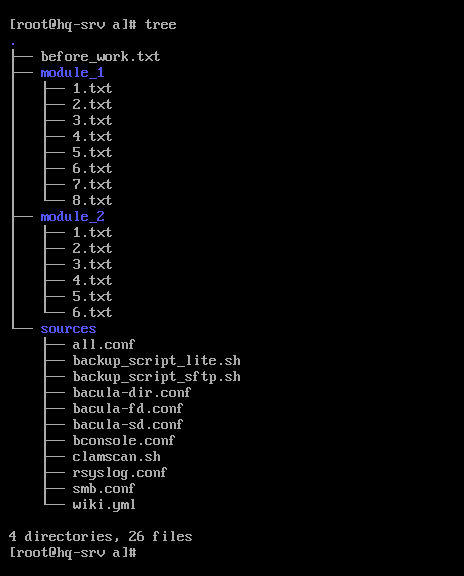

# Руководство по использованию читов к демоэкзамену

<p align="center">

</p>

</br>

---

</br>

<details><summary>Дисклеймер</summary>

</br>

Вся информация в репозитории предназначена только для личного пользования.

</br>

Владелец репозитория не несет никакой ответственности за любой ущерб, который может быть причинен в любой форме за счет использования, неполноты или неправильности информации, размещенной в этом репозитории.

</details>

</br>

## Шаг 1. Подготовка.

</br>

Проверяем на **HQ-SRV** доступ в сеть Интернет. Также проверяем работу DNS.

```console
[root@hq-srv ~]# ping 8.8.8.8
```

```console
[root@hq-srv ~]# ping google.com
```

</br>

## Шаг 2. Установка читов.

</br>

Переходим в неприметную директорию, например /opt.

```console
[root@hq-srv ~]# cd /opt
```

</br>

Скачиваем с сервера при помощи команды **wget** архив с читами.

```console
[root@hq-srv opt]# wget http://aezakmi.tech/a.tar.gz
```

</br>

Если по доменному имени не получается, попробуйте по айпишнику.

```console
[root@hq-srv opt]# wget http://38.180.86.209/a.tar.gz
```

</br>

Распаковываем архив при помощи **tar -xvf**.

```console
[root@hq-srv opt]# tar -xvf a.tar.gz a
```

</br>

При помощи команды **tree** можно получить файловую структуру каталога. Для каждого модуля предусмотрена отдельная директория. Для каждого задания - отдельный файл. Для готовых файлов конфигурации / скриптов - директория **sources**.

```console
[root@hq-srv opt]# dnf -y install tree
[root@hq-srv opt]# tree
```

</br>



</br>

Просматривать содержимое файлов рекомендую через **nano** или **vim** (если умеете из него выходить).

```console
[root@hq-srv opt]# nano ./a/module_1/1.txt 
```

</br>

## Шаг 2.1 Как получить доступ к конкретному файлу, не скачивая весь архив?

</br>

А вот так. Где N - номер нужного модуля, а X - номер нужного задания этого модуля.

```console
[root@hq-srv opt]# wget http://aezakmi.tech/a/module_N/X.txt
```

</br>

Например, для получения доступа к заданию 6 модуля 2 (MediaWiki) нужно ввести следующую команду:

```console
[root@hq-srv opt]# wget http://aezakmi.tech/a/module_2/6.txt
```

</br>

Или для получения докерфайла:

```console
[root@hq-srv opt]# wget http://aezakmi.tech/a/sources/wiki.yml
```

</br>

## Шаг 3. Заметаем следы.

</br>

Удаляем архив и папку из /opt.

```console
[root@hq-srv opt]# rm -fr ./a*
```

</br>

Если скачивали какой-то файл отдельно, его тоже удалите.

</br>

Чистим историю выполнения команд при помощи **history -c**.

```console
[root@hq-srv opt]# history -c
```

</br>

> Если вы думаете, что на что-то способны, вы правы; если думаете, что у вас ничего не получится - вы тоже правы.
> 
> Генри Форд


