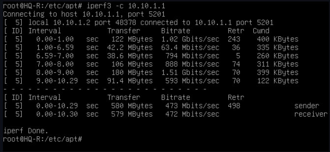

## <a id="module_1">Модуль 1. Выполнение работ по проектированию сетевой инфраструктуры. </a>

</br>

### <a id="module_1_1">1. Выполните базовую настройку всех устройств. </a>

<details> <summary> Open me! </summary>

</br>

**1.1 Присвойте имена в соответствии с топологией.**

Присваивание hostname выполняется при помощи утилиты **hostnamectl** и команды set-hostname.

```console
hostnamectl set-hostname *hostname*
```

</br>

**1.2 Рассчитайте IP-адресацию IPv4 и IPv6. Необходимо заполнить таблицу №1, чтобы эксперты могли проверить ваше рабочее место.**

</br>

**ISP** - /etc/network/interfaces

```console
auto ens161
iface ens161 inet static
  address 192.168.100.1
  netmask 255.255.255.0

auto ens256
iface ens256 inet static
  address 10.10.1.1
  netmask 255.255.255.252

auto ens224
iface ens224 inet static
  address 10.10.2.1
  netmask 255.255.255.252
```

</br>

**HQ-R** - /etc/network/interfaces

```console
auto ens256
iface ens256 inet static
  address 172.16.2.1
  netmask 255.255.255.192

auto ens224
iface ens224 inet static
  address 10.10.1.2
  netmask 255.255.255.252
  gateway 10.10.1.1
```

</br>

**BR-R** - /etc/network/interfaces

```console
auto ens256
iface ens256 inet static
  address 192.168.33.1
  netmask 255.255.255.240

auto ens224
iface ens224 inet static
  address 10.10.2.2
  netmask 255.255.255.252
  gateway 10.10.2.1
```

</br>

**BR-SRV** - /etc/network/interfaces

```console
auto ens224
iface ens224 inet static
  address 192.168.33.10
  netmask 255.255.255.240
  gateway 192.168.33.1
```

</br>

На **HQ-SRV** пока ничего не трогаем до момента настройки DHCP.

</br>

**1.3 Пул адресов для сети офиса BRANCH — не более 16.**

Используем /28 маску (255.255.255.240)

</br>

<details> <summary> Пример расчета маски BRANCH </summary>

</br>

Для начала запишем степени двойки. Они пригодятся.

...

2^1 = 2

2^2 = 4

2^3 = 8

2^4 = 16

2^5 = 32

2^6 = 64

2^7 = 128

...

Смотрим подходящую степень двойки. Ее результат не должен превышать необходимое количество адресов подсети.

В нашем случае это:

2^4 = 16

В 11111111.11111111.11111111.11111111 последние 4 чисел должны быть нулями (4, потому что подходящая степень двойки - 4), следовательно:

11111111.11111111.11111111.11110000 (/28)

Переводим в десятичную.

11111111 = 255

11110000 = 2^7 + 2^6 + 2^5 + 2^4 = 128 + 64 + 32 + 16 = 240

</br>

Результат:

255.255.255.240

</details>

</br>

**1.4 Пул адресов для сети офиса HQ — не более 6.**

Используем /26 маску (255.255.255.192)

</br>

<details> <summary> Пример расчета маски HQ </summary>

</br>

Для начала запишем степени двойки. Они пригодятся.

...

2^1 = 2

2^2 = 4

2^3 = 8

2^4 = 16

2^5 = 32

2^6 = 64

2^7 = 128

...

Смотрим подходящую степень двойки. Ее результат не должен превышать необходимое количество адресов подсети.

В нашем случае это:

2^6 = 64

В 11111111.11111111.11111111.11111111 последние 6 чисел должны быть нулями (6, потому что подходящая степень двойки - 6), следовательно:

11111111.11111111.11111111.11000000 (/27)

Переводим в десятичную.

11111111 = 255

11000000 = 2^7 + 2^6 = 128 + 64 = 192

</br>

Результат:

255.255.255.192

</details>

</br>

Таблица №1. 

| Имя устройства | IP                                    |
|----------------|---------------------------------------|
| CLI            | 192.168.100.100                       |
| ISP            | 10.10.1.1, 10.10.2.1, 192.168.100.1   |
| HQ-R           | 10.10.1.2, 172.16.2.1                 |
| HQ-SRV         | 172.16.2.2                            |
| BR-R           | 10.10.2.2, 192.168.33.1               |
| BR-SRV         | 192.168.33.2                          |
| HQ-CLI         | DHCP                                  |
| HQ-AD          | 172.16.2.3                            |

</details> 

---

</br>

### <a id="module_1_2">2. Настройте внутреннюю динамическую маршрутизацию по средствам FRR. Выберите и обоснуйте выбор протокола динамической маршрутизации из расчёта, что в дальнейшем сеть будет масштабироваться. </a>

<details> <summary> Open me! </summary>

</br>

На виртуальных машинах **HQ-R, BR-R и ISP** включаем пересылку пакетов, редактируя файл */etc/sysctl.conf*.

```console
root@HQ-R:~# nano /etc/sysctl.conf
```

```console
...
Uncomment the next line to enable packet forwarding for IPv4
net.ipv4.ip_forward=1
...
```

```console
root@HQ-R:~# sysctl -p
```

</br>

Устанавливаем на **HQ-R, BR-R, HQ-SRV и ISP** пакет *frr*.

```console
root@ISP:~# apt install frr
```

</br>

На всех четырех машинах редактируем файл */etc/frr/daemons*.

```console
root@ISP:~# nano /etc/frr/daemons
```

</br>

Меняем значение строчки "ospfd" на *yes*.

```console
...
ospfd=yes
...
```

</br>

Перезагружаем на всех четырех машинах службу *frr*.

```console
root@ISP:~# systemctl restart frr
```

</br>

При помощи команды *vtysh* попадаем в Cisco-like терминал.

```console
root@ISP:~# vtysh
Hello, this is FRRouting (version 8.4.4)
Copyright 1996-2005 Kunihiro Ishiguro, et al.

ISP#
```

</br>

Настройка OSPF на **ISP**.

```console
router ospf
network 192.168.100.0/24 area 0
network 10.10.1.0/30 area 0
network 10.10.2.0/30 area 0
```

</br>

Настройка OSPF на **HQ-R**.

```console
router ospf
network 10.10.1.0/30 area 0
network 172.16.2.0/30 area 0
```

</br>

Настройка OSPF на **BR-R**.

```console
router ospf
network 10.10.2.0/30 area 0
network 192.168.33.0/28 area 0
```

</br>

Настройка OSPF на **HQ-SRV**.

```console
router ospf
network 172.16.2.0/30 area 0
```

</br>

Сохраняем конфигурацию на всех четырех машинах.

```console
do wr mem
```

</br>

Убедиться в правильности настройки OSPF можно командой "*sh ip ospf n*".

```console
sh ip ospf n
```

</br>

Включаем на всех четырех машинах службу **frr** и добавляем ее в автозапуск.

```console
systemctl start frr
systemctl restart frr
systemctl enable frr
```

</br>

**2.1 Составьте топологию сети L3.**

Ознакомиться с нашей топологией можно [здесь](https://github.com/caz1que/DEM0/blob/main/network.md).

</br>

</details>

---

</br>

### <a id="module_1_3">3. Настройте автоматическое распределение IP-адресов на роутере HQ-R. </a>

<details> <summary> Open me! </summary>

</br>

**3.1 Учтите, что у сервера должен быть зарезервирован адрес.**

Скачиваем пакет *isc-dhcp-server* на **HQ-R**.

```console
root@HQ-R:~# apt install isc-dhcp-server
```

</br>

Открываем файл конфигурации */etc/default/isc-dhcp-server*.

```console
root@HQ-R:~# nano /etc/default/isc-dhcp-server
```

</br>

В файле в строке "**INTERFACESv4**" указываем интерфейс, ведущий в сеть, где находится HQ-SRV.

```console
...
INTERFACESv4="ens256"
...
```

</br>

На машине **HQ-SRV** пишем *ifconfig* и узнаем MAC-адрес интерфейса.

```console
[root@hq-srv ~]# ifconfig 
```

```console
...
  ether 00:0c:29:37:2e:de txqueuelen 1000 (Ethernet)
...
```

</br>

Приводим файл **/etc/dhcp/dhcpd.conf** к следующему виду:

```console
default-lease-time 600;
max-lease-time 7200;

authoritative;

subnet 172.16.2.0 netmask 255.255.255.192 {
	range 172.16.2.2 172.16.2.63;
	option routers 172.16.2.1;
}

host HQ-SRV {
	hardware ethernet 00:0c:29:37:2e:de;
	fixed-address 172.16.2.2;
}
```

</br>

На **HQ-R** запускаем службу *isc-dhcp-server* и добавляем ее в автозапуск.

```console
root@HQ-R:~# systemctl start isc-dhcp-server
root@HQ-R:~# systemctl enable isc-dhcp-server
```

</br>

Проверяем на **HQ-SRV** выдачу необходимого IP-адреса командой *ifconfig*.

```console
[root@hq-srv ~]# ifconfig 
```

</details>

---

</br>

### <a id="module_1_4">4. Настройте локальные учётные записи на всех устройствах в соответствии с таблицей №2. </a>

<details> <summary> Open me! </summary>

</br>

Таблица №2.

|Учетная запись|Пароль|Примечание|
|---|---|---|
|Admin|P@ssw0rd|CLI, HQ-SRV, HQ-R|
|Branch-admin|P@ssw0rd|BR-SRV, BR-R|
|Network admin|P@ssw0rd|HQ-R, BR-R, BR-SRV|

</br>

**HQ-R**

```console
root@HQ-R:~# useradd adminn -d /home/adminn -m -s /bin/bash
root@HQ-R:~# passwd adminn
Новый пароль: P@ssw0rd
Повторите ввод нового пароля: P@ssw0rd
root@HQ-R:~# useradd network-admin -d /home/network-admin -m -s /bin/bash
root@HQ-R:~# passwd network-admin
Новый пароль: P@ssw0rd
Повторите ввод нового пароля: P@ssw0rd
```

</br>

**HQ-SRV**

```console
[root@hq-srv ~]# useradd adminn -d /home/adminn -m -s /bin/bash
[root@hq-srv ~]# passwd adminn
Новый пароль: P@ssw0rd
Повторите ввод нового пароля: P@ssw0rd
```

</br>

**BR-R**

```console
root@BR-R:~# useradd branch-admin -d /home/branch-admin -m -s /bin/bash
root@BR-R:~# passwd branch-admin
Новый пароль: P@ssw0rd
Повторите ввод нового пароля: P@ssw0rd
root@BR-R:~# useradd network-admin -d /home/network-admin -m -s /bin/bash
root@BR-R:~# passwd network-admin
Новый пароль: P@ssw0rd
Повторите ввод нового пароля: P@ssw0rd
```

</br>

**BR-SRV**

```console
root@BR-SRV:~# useradd branch-admin -d /home/branch-admin -m -s /bin/bash
root@BR-SRV:~# passwd branch-admin
Новый пароль: P@ssw0rd
Повторите ввод нового пароля: P@ssw0rd
root@BR-SRV:~# useradd network-admin -d /home/network-admin -m -s /bin/bash
root@BR-SRV:~# passwd network-admin
Новый пароль: P@ssw0rd
Повторите ввод нового пароля: P@ssw0rd
```

</br>

**CLI**

```console
root@CLI:~# useradd adminn -d /home/adminn -m -s /bin/bash
root@CLI:~# passwd adminn
Новый пароль: P@ssw0rd
Повторите ввод нового пароля: P@ssw0rd
```

</br>

Удалить случайно созданного пользователя можно следующим образом:

```console
root@ISP:~# userdel -f <username>
```

</details>

---

</br>

### <a id="module_1_5">5. Измерьте пропускную способность сети между двумя узлами HQ-R-ISP по средствам утилиты iperf 3. Предоставьте описание пропускной способности канала со скриншотами. </a>

<details> <summary> Open me! </summary>

</br>

Скачиваем пакет iperf3 на виртуальных машинах **ISP** и **HQ-R**.

```console
root@ISP:~# apt install iperf3
```

</br>

Во время установки пакета **iperf3** вас спросят, запустить ли демон iperf3. Если нажимаете "да", то следующую команду ("iperf3 -s") вводить не надо.


</br>

На **ISP** запускаем iperf3 как сервер (если во время установки вы нажали "Нет").

```console
root@ISP:~# iperf3 -s
```

</br>

На **HQ-R** запускаем iperf3 как клиента и указываем IP-адрес ISP.

```console
root@HQ-R:~# iperf3 -c 10.10.1.1
```

</br>




>В описании к скриншоту можно написать среднюю пропускную способность (столбец "Bandwidth"), сколько всего передано за интервал (столбец "Transfer" и т.д.)

</details>

---

</br>

### <a id="module_1_6">6. Составьте backup-скрипты для сохранения конфигурации сетевых устройств, а именно HQ-R, BR-R. Продемонстрируйте их работу. </a>

<details> <summary> Open me! (Lite Edition) </summary>

</br>

Создаем на **HQ-R** и **BR-R** в домашней директории пользователя файл **backup_script.sh** и выдаем права на запуск.

```console
root@HQ-R:/home/adminn# touch backup_script.sh
root@HQ-R:/home/adminn# chmod 755 backup_script.sh
```

</br>

Пишем сам скрипт.

```console
root@HQ-R:/home/adminn# nano backup_script.sh
```

```bash
#!/bin/bash

BACKUP_DIR="/etc/"
BACKUP_NAME="/srv/etc_$(date --iso).tar"

tar -czf ${BACKUP_NAME} ${BACKUP_DIR}

echo "Success!"
```

</br>

Тестим скрипт.

```console
root@HQ-R:/home/adminn# ./backup_script.sh
```

</br>

Переходим по пути **/srv/** и смотрим, есть ли архив.

```console
root@HQ-R:/home/adminn# cd /srv
root@HQ-R:/srv# ls -la 
-rw-r--r--. 1 root	root	5526793 мая 23 19:23 22:01 etc_2024-05-23.tar
```

</details>

</br>

<details> <summary> Open me! (Hard Edition) </summary>

</br>

Создаем файл backup_script.sh на машинах **HQ-R** и **BR-R** в домашней директории любого пользователя и выдаем права на исполнение.

**HQ-R**

```console
root@HQ-R:/home/adminn# touch backup_script.sh
root@HQ-R:/home/adminn# chmod 755 backup_script.sh
```

</br>

**BR-R**

```console
root@BR-R:/home/branch-admin# touch backup_script.sh
root@BR-R:/home/branch-admin# chmod 755 backup_script.sh
```

</br>

На **BR-SRV** и **HQ-SRV** создаем директории /srv/backup для хранения бэкапов.

</br>

**BR-SRV**

```console
root@BR-SRV:~# mkdir /srv/backup
root@BR-SRV:~# chown branch-admin:branch-admin /srv/backup
```

</br>

**HQ-SRV**

```console
[root@hq-srv ~]# mkdir /srv/backup
[root@hq-srv ~]# chown adminn:adminn /srv/backup
```

</br>

**HQ-R** - backup_script.sh

```bash
#!/bin/bash

# Устанавливаем переменные
BACKUP_DIR="/etc"
BACKUP_NAME="etc_backup_$(date --iso).tar"
REMOTE_DIR="/srv/backup"
REMOTE_USER="adminn"
REMOTE_HOST="172.16.2.2"

# Создаем архив директории /etc
tar -czf /tmp/${BACKUP_NAME} ${BACKUP_DIR}

# Отправляем архив на удаленный сервер
sftp ${REMOTE_USER}@${REMOTE_HOST} <<EOF
put /tmp/${BACKUP_NAME} ${REMOTE_DIR}
EOF

# Удаляем локальную копию архива
rm /tmp/${BACKUP_NAME}

echo "Backup of ${BACKUP_DIR} completed successfully."
```

</br>

**BR-R** - backup_script.sh

```bash
#!/bin/bash

# Устанавливаем переменные
BACKUP_DIR="/etc"
BACKUP_NAME="etc_backup_$(date --iso).tar"
REMOTE_DIR="/srv/backup"
REMOTE_USER="branch-admin"
REMOTE_HOST="192.168.33.10"
 
# Создаем архив директории /etc
tar -czf /tmp/${BACKUP_NAME} ${BACKUP_DIR}
 
# Отправляем архив на удаленный сервер
sftp ${REMOTE_USER}@${REMOTE_HOST} <<EOF
put /tmp/${BACKUP_NAME} ${REMOTE_DIR}
EOF
 
# Удаляем локальную копию архива
rm /tmp/${BACKUP_NAME}
 
echo "Backup of ${BACKUP_DIR} completed successfully."
```

</br>

Стартуем скрипты на **HQ-R** и **BR-R**.

```console
root@HQ-R:/home/adminn# ./backup_script.sh
```

```console
root@BR-R:/home/branch-admin# ./backup_script.sh
```

</br>

В ходе выполнения скрипта у вас попросят пароли от пользователей и добавление фингерпринта SSH. Пишем "yes" и пароль - "P@ssw0rd".

</details>

---

</br>

### <a id="module_1_7">7. Настройте подключение по SSH для удалённого конфигурирования устройства HQ-SRV по порту 2222. Учтите, что вам необходимо перенаправить трафик на этот порт по средствам контролирования трафика. </a>

<details> <summary> Open me! </summary>

</br>

Открываем файл конфига SSH - **/etc/ssh/sshd_config**.

```console
[root@hq-srv ~]# vim /etc/ssh/sshd_config
```

</br>

Расскоменчиваем параметр "Port" и меняем его на **2222**.

```console
...
Port 2222
...
```

</br>

Пишем вот эту хуету

```console
[root@hq-srv ~]# semanage port -a -t ssh_port_t -p tcp 2222
```

</br>

Перезагружаем службу **sshd**.

```console
[root@hq-srv ~]# systemctl restart sshd
```

</br>

Отключаем **firewalld** и убираем его из автозапуска.

```console
[root@hq-srv ~]# systemctl stop firewalld
[root@hq-srv ~]# systemctl disable firewalld
```

</br>

Проверяем: подключаемся с **HQ-R** на **HQ-SRV** по SSH с указанием порта.

```console
root@HQ-R:~# ssh adminn@172.16.2.2 -p 2222
```

</br>

>**ВАЖНО**: если в предыдущем задании вы настраивали отправку бэкапа на удаленный сервер по sftp, то необходимо изменить **backup_script.sh** на **HQ-R**.

</br>

```console
...
# Отправляем архив на удаленный сервер
sftp -P 2222 ${REMOTE_USER}@${REMOTE_HOST} <<EOF
...
```

</details>

---

</br>

### <a id="module_1_8">8. Настройте контроль доступа до HQ-SRV по SSH со всех устройств, кроме CLI. </a>

<details> <summary> Open me! </summary>

</br>

Создаем правило для **iptables** на **HQ-SRV**.

```console
[root@hq-srv ~]# sudo iptables -A INPUT -p tcp -s 192.168.100.100 --dport 2222 -j DROP
```

</br>

Для того, чтобы правила iptables сохранились после перезагрузки системы, выполняем следующую команду.

```console
[root@hq-srv ~]# iptables-save > /etc/sysconfig/iptables
```

</br>

Скачиваем пакет **iptables-services**.

```console
[root@hq-srv ~]# dnf -y install iptables-services
```

</br>

Включаем автозапуск для службы **iptables** и запускаем.

```console
[root@hq-srv ~]# systemctl enable iptables
[root@hq-srv ~]# systemctl start iptables
```

</br>

Проверяем как обрывается подключение на **CLI**.

```console
root@CLI:~# ssh adminn@172.16.2.2 -p 2222
ssh: connect to host 172.16.2.2 port 2222: Connection refused
```

</br>

</details>

---

</br>

