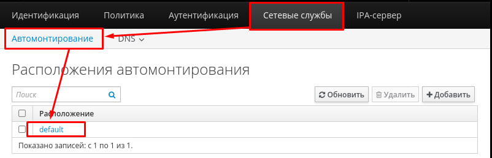

## <a id="module_2">Модуль 2. Организация сетевого администрирования. </a>

</br>

### <a id="module_2_1">1. Настройте DNS-сервер на сервере HQ-SRV. </a>

<details> <summary> Open me! </summary>

</br>

**1.1. На DNS сервере необходимо настроить 2 зоны:**

Зона hq.work, также не забудьте настроить обратную зону.

| Имя              | Тип записи | Адрес      |
|------------------|------------|------------|
| hq-r.hq.work     | A, PTR     | IP-адрес   |
| hq-srv.hq.work   | A, PTR     | IP-адрес   |

</br>

Зона branch.work, также не забудьте настроить обратную зону.

| Имя                | Тип записи | Адрес    |
| ------------------ | ---------- | -------- |
| br-r.branch.work   | A, PTR     | IP-адрес |
| br-srv.branch.work | A, PTR     | IP-адрес |

</br>

> Примечание: дальше будет пиздец

</br>

Заходим на **HQ-SRV** и редактируем файл */etc/hosts*. Добавляем запись для доменного имени **hq-srv.hq.work**.

```console
[root@hq-srv ~]# vim /etc/hosts
```

```console
...
172.16.2.2 hq-srv.hq.work hq-srv
```

</br>

Ставим hostname при помощи **hostnamectl** на **HQ-SRV**.

```console
[root@hq-srv ~]# hostnamectl set-hostname hq-srv.hq.work
```

</br>

Редактируем файл конфигурации **SELinux** по пути */etc/selinux/config*. Меняем значение "SELINUX" на "permissive".

```console
[root@hq-srv ~]# vim /etc/selinux/config
```

```console
...
SELINUX=permissive
...
```

</br>

После этого перезагружаем **HQ-SRV**.

```console
[root@hq-srv ~]# reboot now
```

</br>

После перезагрузки проверяем режим работы SELinux при помощи команды **sudo getenforce**.

```console
[root@hq-srv ~]# sudo getenforce
Permissive
```

</br>

Переименовываем файл **/etc/resolv.conf** в **/etc/resolv.conf.old**.

```console
[root@hq-srv ~]# mv /etc/resolv.conf /etc/resolv.conf.old
```

</br>

Создаем и редактируем новый файл **/etc/resolv.conf**. Пишем IP-адрес DNS-сервера **8.8.8.8** и домен **hq.work**.

```console
[root@hq-srv ~]# vim /etc/resolv.conf
```

```console
nameserver 8.8.8.8
search hq.work
```

</br>

Скачиваем при помощи пакетного менеджера **dnf** пакеты **ipa-server** и **ipa-server-dns**. После вопросов "Продолжить?" жмем **y**.

```console
[root@hq-srv ~]# sudo dnf install ipa-server ipa-server-dns
```

</br>

После установки пакетов выполняем команду **ipa-server-install**.

```console
[root@hq-srv ~]# sudo ipa-server-install --setup-dns --allow-zone-overlap --reverse-zone=2.16.172.in-addr.arpa
```

</br>

Кратенько о параметрах команды:

- **–setup-dns** – этот параметр говорит мастеру установки о том, что необходимо установить и настроить встроенный сервер DNS.
- **–allow-zone-overlap** – если у вас уже где-то используется имя домена, то установка сервера FreeIPA может завершиться с ошибкой. Данный параметр позволяет обойти эту самую ошибку.
- **--reverse-zone** - сразу создает обратную зону в DNS-сервере.

</br>

После запуска команды повторяем действия на скриншотах ниже.


</br>

> Примечание: установка FreeIPA достаточно продолжительная, поэтому рекомендуем пока она качается поделать другую часть задания, чтобы не терять время

</br>

Если после установки вылезло сообщение с портами, значит установка FreeIPA прошла успешно.

</br>


</br>

Не забываем проверить выключен ли **firewalld**. Если включен - выключаем.

```console
[root@hq-srv ~]# systemctl status firewalld
[root@hq-srv ~]# systemctl stop firewalld
```

</br>

Теперь можем проверить корректность настройки FreeIPA при помощи команды **sudo ipactl status**. 

```console
[root@hq-srv ~]# sudo ipactl status
Directory Service: RUNNING
krb5kdc Service: RUNNING
kadmin Service: RUNNING
named Service: RUNNING
httpd Service: RUNNING
ipa-custodia Service: RUNNING
pki-tomcatd Service: RUNNING
ipa-otpd Service: RUNNING
ipa-dnskeysyncd Service: RUNNING
ipa: INFO: The ipactl command was successful
```

</br>

Также запрашиваем билет Kerberos для пользователя **admin** при помощи команды **kinit**. Запросит пароль, пишем P@ssw0rd.

```console
[root@hq-srv ~]# sudo kinit admin
Password for admin@HQ.WORK: 
```

</br>

Проверяем наличие билета при помощи команды **klist**.

```console
[root@hq-srv ~]# sudo klist
Ticket cache: KCM:0
Default principal: admin@HQ.WORK

Valid starting		Expires			    Service principal
11.05.2024 20:36:33	12.05.2024 19:41:03	krbtgt/HQ.WORK@HQ.WORK
```

</br>

Теперь залетаем на **CLI**. Ставим hostname с доменом при помощи **hostnamectl set-hostname**.

```console
root@CLI:~# hostnamectl set-hostname cli.hq.work
```

</br>

Редачим файл **/etc/hosts** и добавляем запись для **HQ-SRV**. Также добавляем запись **cli.hq.work** для локального адреса.

```console
root@CLI:~# nano /etc/hosts
```

```console
127.0.0.1 cli.hq.work localhost debian
127.0.1.1 cli.hq.work localhost debian

172.16.2.2 hq-srv.hq.work    hq-srv
```

</br>

Переименовываем **/etc/resolv.conf** в **/etc/resolv.conf.old**.

```console
root@CLI:~# mv /etc/resolv.conf /etc/resolv.conf.old
```

</br>

Создаем и редачим новый **/etc/resolv.conf**.

```console
root@CLI:~# nano /etc/resolv.conf
```

```console
nameserver 172.16.2.2
search hq.work
```

</br>

Проверяем доступность доменного имени **hq-srv.hq.work** при помощи пинга на **CLI**. Запросы должны быть успешными.

```console
root@CLI:~# ping hq-srv.hq.work
```

</br>

Скачиваем пакет **freeipa-client** на **CLI**. В процессе установки вас будут спрашивать какую-то хуйню, оставляем все по умолчанию и пустым.

```console
root@CLI:~# apt install freeipa-client
```

</br>

Добавляем клиента **CLI** в домен при помощи команды **ipa-client-install**.

```console
root@CLI:~# sudo ipa-client-install --mkhomedir --domain hq.work --realm HQ.WORK --enable-dns-updates
This program will set up IPA client.
Version 4.9.11
```

</br>

Процесс выполнения команды должен быть такой же, как на скрине ниже.


</br>

Заходим в браузер (в нашем случае это Firefox на CLI) и переходим по адресу https://hq-srv.hq.work/ipa/ui.


</br>

Вводим данные пользователя: имя **admin** и пароль **P@ssw0rd**.


</br>

Заходим в "Сетевые службы", затем в "DNS" - "Зоны DNS".


</br>

Добавляем новую зону прямую "branch.work" и обратную зону для подсети BRANCH (в нашем случае это 192.168.33.0/28). При создании прямой зоны нажмите на галочку **"Пропустить проверку пересечения"**.


</br>

Создаем А-запись в прямой зоне "hq.work" для узла **HQ-R**. Не забываем нажать на галочку "Create reverse", чтобы сразу создать запись в обратной зоне. Для **HQ-SRV** и **CLI** записи у нас уже есть.


</br>

Аналогичным образом делаем А-записи для **BR-SRV** и **BR-R** в прямой зоне "branch.work".


</br>

Теперь можно заняться добавлением **BR-SRV** в домен. Заходим и проделываем примерно такие же процедуры с файлом **/etc/resolv.conf**, что и на **CLI**.

```console
root@BR-SRV:~# mv /etc/resolv.conf /etc/resolv.conf.old
```

```console
root@BR-SRV:~# nano /etc/resolv.conf
```

```console
nameserver 172.16.2.2
search hq.work branch.work
domains hq.work branch.work
```

</br>

Редачим **/etc/hosts**, добавляем запись для **hq-srv.hq.work** и самого **br-srv.branch.work**.

```console
root@BR-SRV:~# nano /etc/hosts
```

```console
127.0.0.1 br-srv.branch.work localhost debian
127.0.1.1 br-srv.branch.work localhost debian

172.16.2.2 hq-srv.hq.work
```

</br>

Меняем hostname на **br-srv.branch.work** при помощи **hostnamectl**.

```console
root@BR-SRV:~# hostnamectl set-hostname br-srv.branch.work
```

</br>

Скачиваем пакет **freeipa-client**. Все оставляем по умолчанию и пустым.

```console
root@BR-SRV:~# apt install freeipa-client -y
```

</br>

Добавляем **BR-SRV** в домен при помощи команды **ipa-client-install**.

```console
root@BR-SRV:~# sudo ipa-client-install
```


</br>

Вводим имя пользователя **admin** и пароль **P@ssw0rd**.


</br>

> BOMBACLAAT! RASTACLAAT! PUSSYCLAAT! Если вы сделали действия выше, обратитесь в Massachusetts Institute of Technology за дипломом

</br>

</details>

---

</br>

### <a id="module_2_2">2. Настройте синхронизацию времени между сетевыми устройствами по протоколу NTP. </a>

<details> <summary> Open me! </summary>

</br>

**2.1 Используйте Loopback интерфейс на HQ-R, как источник сервера времени.**

**2.2 Все остальные устройства и сервера должны синхронизировать свое время с роутером HQ-R.**

**2.3 Все устройства и сервера настроены на московский часовой пояс (UTC +3).**

</br>

Устанавливаем пакет *chrony* на **всех** устройствах (HQ-SRV, HQ-R, BR-SRV, BR-R, ISP, CLI).

```console
root@HQ-R:~# apt install chrony -y
```

</br>

Включаем автозапуск для службы *chrony*.

```console
root@HQ-R:~# systemctl enable chrony
```

</br>

> Примечание: служба на HQ-SRV называется chronyd.

</br>

Редактируем конфигурационный файл */etc/chrony/chrony.conf*.

```console
root@HQ-R:~# nano /etc/chrony/chrony.conf
```

```console
# Welcome to the chrony configuration file. See chrony.conf(5) for more
# information about usable directives.

server 127.0.0.1 prefer iburst

local stratum 5
manual
allow

# Include configuration files found in /etc/chrony/conf.d.
confdir /etc/chrony/conf.d

# Use Debian vendor zone.
# pool 2.debian.pool.ntp.org iburst

# Use time sources from DHCP
# sourcedir /run/chrony-dhcp

# Use NTP sources found in /etc/chrony/sources.d.
# sourcedir /etc/chrony/sources.d

# This directive specify the location of the file containing ID/key pairs for
# NTP authentication.
# keyfile /etc/chrony/chrony.keys

# This directive specify the file into which chronyd will store the rate
# information.
driftfile /var/lib/chrony/chrony.drift
...
```

</br>

Устанавливаем московский часовой пояс (UTC +3) на **всех** устройствах.

```console
root@HQ-R:~# timedatectl set-timezone Europe/Moscow
```

</br>

Приводим конфигурационный файл */etc/chrony/chrony.conf* на всех остальных устройствах к следующему виду (HQ-SRV, BR-R, BR-SRV, ISP, CLI).

```console
root@BR-R:~# nano /etc/chrony/chrony.conf
```

```console
# Welcome to the chrony configuration file. See chrony.conf(5) for more
# information about usable directives.

server 172.16.2.1 prefer iburst

# Include configuration files found in /etc/chrony/conf.d.
confdir /etc/chrony/conf.d

# Use Debian vendor zone.
# pool 2.debian.pool.ntp.org iburst

# Use time sources from DHCP
# sourcedir /run/chrony-dhcp

# Use NTP sources found in /etc/chrony/sources.d.
# sourcedir /etc/chrony/sources.d

# This directive specify the location of the file containing ID/key pairs for
# NTP authentication.
# keyfile /etc/chrony/chrony.keys

# This directive specify the file into which chronyd will store the rate
# information.
driftfile /var/lib/chrony/chrony.drift
...
```

</br>

> Примечание: путь к chrony.conf на HQ-SRV выглядит как /etc/chrony.conf.

</br>

Перезагружаем службу *chrony* на **всех устройствах**.

```console
root@HQ-R:~# systemctl restart chrony
```

</br>

Проверить работу NTP на клиентах можно при помощи команды **chronyc sources**.


</br>

Проверить же, подключены ли клиенты к NTP-серверу на **HQ-R** можно при помощи команды **chronyc clients**.


</br>

</details>

---

</br>

### <a id="module_2_3">3. Настройте сервер домена выбор, его типа обоснуйте, на базе HQ-SRV через web интерфейс, выбор технологий обоснуйте. </a>

<details> <summary> Open me! </summary>

</br>

**3.1 Введите машины BR-SRV и CLI в данный домен**

</br>

Мы уже настроили сервер домена **FreeIPA** в самом [начале](#module_2_1) этого модуля, без него бы не получилось бы настроить DNS. Поэтому едем дальше.

</br>

</details>

---

</br>

### <a id="module_2_4">4. Реализуйте файловый SMB или NFS (выбор обоснуйте) сервер на базе сервера HQ-SRV. </a>

<details> <summary> Open me! </summary>

</br>

**4.1. Должны быть опубликованы общие папки по названиям:**

**i. Branch_Files — только для пользователя Branch admin;**

**ii. Network — только для пользователя Network admin;**

**iii. Admin_Files — только для пользователя Admin;**

**4.2. Каждая папка должна монтироваться на всех серверах в папку /mnt/ (например, /mnt/All_files) автоматически при входе доменного пользователя в систему и отключаться при его выходе из сессии. Монтироваться должны только доступные пользователю каталоги.**

</br>

Первым делом необходимо создать доменных пользователей: **network-admin** и **branch-admin**. Пользователь **admin** у нас уже имеется. Пароль всем назначаем: **P@ssw0rd**.


</br>

Далее переходим в "IPA-сервер" - "Разрешения". Нажимаем "Добавить".


</br>

Имя для разрешения указываем любое. **Тип правила привязки**: permission. **Предоставленные права**: read, search, compare. **Тип**: "пользователь". **Действующие атрибуты**: ipantsecurityidentifier, ipanthash.


</br>

Теперь переходим в "IPA-сервер" - "Привилегии". Добавляем новую привилегию. Имя для привилегии указываем любое.


</br>


</br>

Теперь переходим в созданную привилегию (нажав на ее название в списке). Нажимаем "Разрешения", затем "Добавить".


</br>

В поле для ввода пишем часть названия вашего разрешения, жмем "Фильтр". Затем выбираем разрешение и жмем на "**>**". После жмем "Добавить".


</br>

Переходим в "IPA-сервер" - "Роли". Жмем "Добавить".


</br>

Называем роль как хотим, жмем "Добавить".


</br>

Нажимаем на имя роли в списке ролей, жмем на "Привилегии" - "Добавить".


</br>

Находим нашу созданную привилегию и добавляем в роль.


</br>

Переходим в "Идентификация" - "Службы". Жмем "Добавить".


</br>

Служба - "**cifs**". Имя узла - "**hq-srv.hq.work**". Не забываем нажать галочку "Принудительно".


</br>

Заходим в саму службу, нажав на ее имя в списке. Жмем "Роли" - "Добавить".


</br>

Добавляем службу в ранее созданную роль.


</br>

Также скачиваем пакет **ipa-server-trust-ad** и вводим команду ipa-adtrust-install --add-sids.

```console
[root@hq-srv ~]# dnf -y install freeipa-server-trust-ad
[root@hq-srv ~]# ipa-adtrust-install --add-sids
```

</br>

В ходе выполнения команды вводим пароль, затем пишем "yes", затем пишем "no".


</br>

Создаем три директории - **/srv/Admin_Files**, **/srv/Network**, **/srv/Branch_Files**. 

```console
[root@hq-srv ~]# mkdir /srv/Admin_Files
[root@hq-srv ~]# mkdir /srv/Network
[root@hq-srv ~]# mkdir /srv/Branch_Files
```

</br>

На минутку надо вернуться в веб-интерфейс FreeIPA. Открываем список пользователей и смотрим их **UID**. Их надо запомнить или записать.


</br>

Теперь выдаем права при помощи команды **chown** доменным пользователям при помощи указания их UID.

```console
[root@hq-srv ~]# chown 1113000000:11130000000 /srv/Admin_Files
[root@hq-srv ~]# chown 1113000004:11130000004 /srv/Branch_Files
[root@hq-srv ~]# chown 1113000003:11130000003 /srv/Network
```

</br>

Также выставляем привилегии при помощи команды **chmod** на все содержимое директории /srv.

```console
[root@hq-srv ~]# chmod 700 /srv/*
```

</br>

По итогу содержимое директории **/srv** должно выглядеть так.


</br>

Открываем и редактируем конфиг **Samba** - /etc/samba/smb.conf. Приводим его к следующему виду.

```console
[root@hq-srv ~]# vim /etc/samba/smb.conf
```

```console
[global]
state directory = /var/lib/samba
cache directory = /var/lib/samba
include = registry

workgroup = HQ
realm = HQ.WORK
security = USER

[Admin_Files]
path = /srv/Admin_Files
valid users = admin@HQ.WORK
browseable = yes
read only = no

[Network]
path = /srv/Network
valid users = network-admin@HQ.WORK
browseable = yes
read only = no

[Branch_Files]
path = /srv/Branch_Files
valid users = branch-admin@HQ.WORK
browseable = yes
read only = no
```

</br>

Запускаем и включаем автозапуск службы **smb**.

```console
[root@hq-srv ~]# systemctl restart smb
[root@hq-srv ~]# systemctl enable smb
```

</br>

Скачиваем пакет **samba-client** на **HQ-SRV**, **CLI**, **BR-SRV**.

```console
[root@hq-srv ~]# dnf -y install samba-client
```

```console
root@br-srv:~# apt install samba-client -y
root@cli:~# apt install samba-client -y
```

</br>

Проверяем подключение к папке за доменного пользователя. Например, ниже показано подключение за пользователя admin@HQ.WORK к папке "**Admin_Files**".

```console
[root@hq-srv ~]# smbclient -U admin@HQ.WORK //hq-srv.hq.work/Admin_Files
Password for [admin@HQ.WORK]:
Try "help" to get a list of possible commands.
smb: \>
```

</br>

Проверьте аналогичным образом подключение на **BR-SRV**.

```console
root@BR-SRV:~# smbclient -U admin@HQ.WORK //hq-srv.hq.work/Admin_Files
Password for [admin@HQ.WORK]:
Try "help" to get a list of possible commands.
smb: \>
```

</br>

Теперь можно перейти к настройке автомонтирования. Скачиваем на **HQ-SRV**, **BR-SRV** и **CLI** пакеты **autofs** и **cifs-utils**.

```console
root@BR-SRV:~# apt install autofs cifs-utils -y
```

```console
root@CLI:~# apt install autofs cifs-utils -y
```

```console
[root@hq-srv ~]# dnf -y install autofs cifs-utils
```

</br>

Переходим в веб-интерфейс FreeIPA. Переходим в "Сетевые службы" - "Автомонтирование". Затем открываем расположение "default".



</br>

Открываем список автомонтирования "auto.direct".


</br>

Создаем три ключа автомонтирования со следующими параметрами:

| Ключ                        | Сведения автомонтирования                               |
| --------------------------- | ------------------------------------------------------- |
| /srv/All_Files/Admin_Files  | -fstype=cifs,rw,noperm,credentials=/root/.admin         |
| /srv/All_Files/Network      | -fstype=cifs,rw,noperm,credentials=/root/.network-admin |
| /srv/All_Files/Branch_Files | -fstype=cifs,rw,noperm,credentials=/root/.branch-admin  |

</br>


</br>

На **BR-SRV**, **CLI**, **BR-SRV** создаем три файла в директории **/root**:

```console
cd /root
touch .admin
touch .network-admin
touch .branch-admin
```

</br>

Редактируем файлы. Указываем имя пользователя, пароль и домен.

```console
nano .admin
```

```console
username=admin
password=P@ssw0rd
domain=HQ.WORK
```

</br>

```console
nano .branch-admin
```

```console
username=branch-admin
password=P@ssw0rd
domain=HQ.WORK
```

</br>

```console
nano .network-admin
```

```console
username=network-admin
password=P@ssw0rd
domain=HQ.WORK
```

</br>

На **HQ-SRV**, **CLI** и **BR-SRV** вводим команду **sudo ipa-client-automount --location=default**. Когда просят что-то написать, пишем **yes**.

```console
sudo ipa-client-automount --location=default
```


</br>

Перезагружаем **CLI**, **HQ-SRV**, **BR-SRV**.

```console
reboot now
```

</br>

Проверяем работу **smb** на **HQ-SRV**. Если он лежит - перезапускаем - **systemctl restart smb**.

```console
[root@hq-srv ~]# systemctl status smb
[root@hq-srv ~]# systemctl restart smb
```

</br>

Затем переходим в директорию **/srv/** на **CLI** или **BR-SRV** и видим наличие директории **All_Files**. В ней же лежат директории **Network**, **Admin_Files**, **Branch_Files**.

```console
root@CLI:~# cd /srv
root@CLI:/srv# cd All_Files
root@CLI:/srv/All_Files# ls -la
итого 8
drwxr-xr-x 5 root root 4096 мая 27 03:30 .
drwxr-xr-x 3 root root 4096 мая 27 02:37 ..
drwxr-xr-x 2 root root    0 мая 27 03:30 Admin_Files
drwxr-xr-x 2 root root    0 мая 24 01:07 Branch_Files
drwxr-xr-x 2 root root    0 мая 24 01:07 Network
```

</br>

Попробуем перейти в директорию **Admin_Files** и создать в ней файл **test**.

```console
root@CLI:/srv/All_Files# cd Admin_Files
root@CLI:/srv/All_Files/Admin_Files# touch test
```

</br>

После создания файла он должен появиться в директории **/srv/Admin_Files** на **HQ-SRV**.

```console
root@hq-srv:/srv/Admin_Files# ls -la
итого 0
drwxr-xr-x. 2 admin admins  18 мая 27 03:50 .
drwxr-xr-x. 5 root  root   151 мая 24 06:02 ..
-rwxr--r--. 1 admin admins   0 мая 27 03:50 test
```

</br>

> Примечание: если после перехода в директории Admin_Files, Branch_Files, Network, вам пишут что "такой директории не существует", значит скорее всего вы где-то накосячили с файлами /root/.admin, /root/.branch-admin, /root/.network-admin

</br>

</details>

---

</br>

### <a id="module_2_5">5. Сконфигурируйте веб-сервер LMS Apache на сервере BR-SRV. </a>

<details> <summary> Open me! </summary>

</br>

**5.1. На главной странице должен отражаться номер места.**

**5.2. Используйте базу данных mySQL.**

**5.3. Создайте пользователей в соответствии с таблицей, пароли у всех пользователей «P@ssw0rd».**

</br>

| Пользователь | Группа  |
|--------------|---------|
| Admin        | Admin   |
| Manager1     | Manager |
| Manager2     | Manager |
| Manager3     | Manager |
| User1        | User    |
| User2        | User    |
| User3        | User    |
| User4        | User    |
| User5        | User    |
| User6        | User    |
| User7        | User    |

</br>

Скачиваем пакет **apache2** на **BR-SRV**.

```console
root@BR-SRV:~# apt install apache2
```

</br>

Опустошаем файл **/var/www/html/index.html**.

```console
root@BR-SRV:~# echo "" > /var/www/html/index.html
```

</br>

Редактируем файл **/var/www/html/index.html**. Внутри тега "span" должен быть номер вашего рабочего места.

```console
root@BR-SRV:~# nano /var/www/html/index.html
```

```console
<html>
<head>
	<meta charset='utf-8'>
	<title> DEMO </title>
</head>
<body>
	<span> 14 </span>
</body>
</html>
```

</br>

Переходим по IP-адресу **BR-SRV** и видим страничку.


</br>

Скачиваем пакет **mariadb-server**.

```console
root@BR-SRV:~# apt install mariadb-server -y
```

</br>

Логинимся за юзера **root** в **mysql**. Пароль - **пустой**, просто жмем Enter.

```console
root@BR-SRV:~# mysql -u root -p
Enter password: 
```

</br>

Пишем SQL-запросы на создание пользователей.

```console
CREATE USER "Admin"@"localhost" IDENTIFIED BY "P@ssw0rd";
CREATE USER "Manager1"@"localhost" IDENTIFIED BY "P@ssw0rd";
CREATE USER "Manager2"@"localhost" IDENTIFIED BY "P@ssw0rd";
CREATE USER "Manager3"@"localhost" IDENTIFIED BY "P@ssw0rd";
CREATE USER "User1"@"localhost" IDENTIFIED BY "P@ssw0rd";
CREATE USER "User2"@"localhost" IDENTIFIED BY "P@ssw0rd";
CREATE USER "User3"@"localhost" IDENTIFIED BY "P@ssw0rd";
CREATE USER "User4"@"localhost" IDENTIFIED BY "P@ssw0rd";
CREATE USER "User5"@"localhost" IDENTIFIED BY "P@ssw0rd";
CREATE USER "User6"@"localhost" IDENTIFIED BY "P@ssw0rd";
CREATE USER "User7"@"localhost" IDENTIFIED BY "P@ssw0rd";
```

</br>

Удалить случайно созданного пользователя можно следующей командой:

```console
DROP USER "User"@"localhost";
```

</details>

---

</br>

### <a id="module_2_6">6. Запустите сервис MediaWiki используя docker на сервере HQ-SRV. </a>

<details> <summary> Open me! </summary>

</br>

6.1. Установите Docker и Docker Compose.

6.2. Создайте в домашней директории пользователя файл wiki.yml для приложения MediaWiki:

6.2.1. Средствами docker compose должен создаваться стек контейнеров с приложением MediaWiki и базой данных

6.2.2. Используйте два сервиса; 

6.2.3. Основной контейнер MediaWiki должен называться wiki и использовать образ mediawiki; 

6.2.4. Файл LocalSettings.php с корректными настройками должен находиться в домашней папке пользователя и автоматически монтироваться в образ;  

6.2.5. Контейнер с базой данных должен называться db и использовать образ mysql;

6.2.6. Он должен создавать базу с названием mediawiki, доступную по стандартному порту, для пользователя wiki с паролем DEP@ssw0rd; 

6.2.7. База должна храниться в отдельном volume с названием dbvolume.  
MediaWiki должна быть доступна извне через порт 8080.

</br>

Скачиваем пакеты **docker** и **docker-compose** на **HQ-SRV**.

```console
[root@hq-srv ~]# dnf -y install docker docker-compose
```

</br>

Включаем службу **docker** и добавляем ее в автозапуск.

```console
[root@hq-srv ~]# systemctl start docker
[root@hq-srv ~]# systemctl enable docker
```

</br>

Создаем файл **wiki.yml** в домашней директории пользователя.

```console
[root@hq-srv ~]# touch /home/adminn/wiki.yml
```

</br>

Создаем папку **images** в домашней директории пользователя.

```console
[root@hq-srv /home/adminn]# mkdir images
```

</br>

Создаем volume **dbvolume** при помощи команды **docker volume create**.

```console
[root@hq-srv ~]# docker volume create dbvolume
```

</br>

Редактируем файл **wiki.yml** и создаем необходимые сервисы.

```console
[root@hq-srv /home/adminn/]# nano wiki.yml
```

```console
version: '3'
services:
  MediaWiki:
    image: mediawiki
    container_name: wiki
    restart: always
    ports:
      - 8080:80
    volumes:
      - ./images:/var/www/html/images
    depends_on:
      - database
  database:
     image: mysql
     container_name: db
     environment:
       MYSQL_DATABASE: mediawiki
       MYSQL_USER: wiki
       MYSQL_PASSWORD: DEP@ssw0rd
       MYSQL_RANDOM_ROOT_PASSWORD: 'yes'
    volumes:
       - dbvolume:/var/lib/mysql
volumes:
  dbvolume:
    external: true
```

</br>

При попытке запустить docker-compose вылетит ошибка о том, что 8080 порт уже используется. Поэтому надо исправить этот момент.


</br>

Чтобы открыть 8080 порт, нужно открыть файл **/etc/tomcat/server.xml** и найти вот эту часть конфига.

```console
<Connector port="8080" protocol="HTTP/1.1"
connectionTimeout="20000"
redirectPort="8443"
maxParameterCount="1000"
/>
```

</br>

Затем закомментить ее следующим образом:

```console
<!--
<Connector port="8080" protocol="HTTP/1.1"
connectionTimeout="20000"
redirectPort="8443"
maxParameterCount="1000"
/>
-->
```

</br>

Выключаем службу **pki-tomcatd@pki-tomcat** и убираем ее из автозапуска.

```console
[root@hq-srv ~]# systemctl stop pki-tomcatd@pki-tomcat
[root@hq-srv ~]# systemctl disable pki-tomcatd@pki-tomcat
```

</br>

Затем делаем reboot системы.

```console
[root@hq-srv ~]# reboot now
```

</br>

Теперь можно поднимать сервисы при помощи команды **docker-compose up**. Не забываем также указать имя файла.

```console
[root@hq-srv /home/adminn]# docker-compose -f wiki.yml up
```

</br>

Переходим по IP-адресу **HQ-SRV** и порту 8080 в браузере (hq-srv.hq.work:8080). Появится логотип MediaWiki и кликабельная подпись внизу, тыкаем на нее.


</br>

Начнется установка MediaWiki. Оставляем русский язык по умолчанию и жмем "Далее".


</br>

Следующий этап установки - соединение с сервером БД. Указываем в качестве хоста имя контейнера - "**db**". Имя базы данных - "**mediawiki**".


</br>

Имя пользователя базы данных - "**wiki**". Пароль базы данных - "**DEP@ssw0rd**".


</br>

На следующем этапе ставим галочку и жмем "Далее".


</br>

На следующем этапе указываем любое название вики.


</br>

Имя участника - **admin**. Пароль - "**DEP@ssw0rd**". Адрес электронной почты - желательно ваш мптшный.


</br>

В самом низу жмем галочку "Хватит, установить вики". А то уже заебали внатуре. Жмем "Далее".


</br>

Далее жмем "Далее".


</br>

Видим, что все выполнено, и жмем "Далее". Вот бы всю демку просто "Далее" хуячить


</br>

Свершилось - получаем на выходе установку файла **LocalSettings.php**.


</br>

Смотрим, где он лежит. Для удобства рекомендую перенести его из "Загрузки" в домашнюю директорию (/home/adminn), чтобы лишний раз не менять раскладку.


</br>

Возвращаемся в терминал **HQ-SRV**. Подключаемся по sftp к **CLI**, и скачиваем файл через команду **get** в домашнюю директорию (/home/adminn).

```console
[root@hq-srv ~]# sftp adminn@192.168.100.100
Connected to 192.168.100.100.
sftp>
sftp> get LocalSettings.php /home/adminn/LocalSettings.php
sftp> exit
```

</br>

Меняем файл **wiki.yml**. Добавляем новый volume для сервиса MediaWiki: пробрасываем файл **LocalSettings.php** по пути **/var/www/html/LocalSettings.php**.

```console
[root@hq-srv /home/adminn]# nano wiki.yml
```

```console
...
      - 8080:80
    volumes:
      - ./images:/var/www/html/images
      - ./LocalSettings.php:/var/www/html/LocalSettings.php
    depends_on:
...
```

</br>

Опускаем и поднимаем docker-compose (мне обычный restart не помог).

```console
[root@hq-srv /home/adminn]# docker-compose -f wiki.yml down
[root@hq-srv /home/adminn]# docker-compose -f wiki.yml up
```

</br>

Снова переходим на 8080 порт **HQ-SRV** (hq-srv.hq.work:8080) и видим, что MediaWiki работает.


</br>

</details>

---

</br>


