## <a id="module_3">Модуль 3. Эксплуатация объектов сетевой инфраструктуры. </a>

</br>

### <a id="module_3_1">1. Реализуйте мониторинг по средствам rsyslog на всех Linux хостах. </a>

<details> <summary> Open me! </summary>

</br>

**1.1 Составьте отчёт о том, как работает мониторинг.**

</br>

Устанавливаем пакет **rsyslog** на все тачки.

```console
apt install rsyslog-* -y
```

Также на **HQ-SRV**.

```
dnf -y install rsyslog-*
```

</br>

Во время установки пакетов везде жмем "Нет".

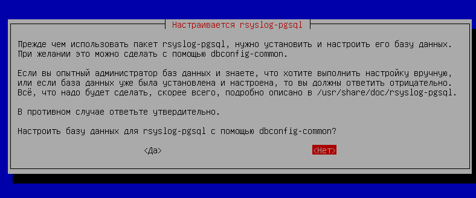

</br>

Включаем автозапуск службы и стартуем ее.

```console
systemctl start rsyslog
systemctl enable rsyslog
```

</br>

В качестве центрального сервера, который будет принимать логи с остальных устройств, будет выступать **HQ-SRV**.

</br>

Редактируем на **HQ-SRV** файл **/etc/rsyslog.conf**.

```console
[root@hq-srv ~]# nano /etc/rsyslog.conf
```

</br>

Расскоменчиваем эти параметры.

```console
...
# provides UDP syslog reception
module(load="imudp")
input(type="imudp" port="514")

# provides TCP syslog reception
module(load="imtcp")
input(type="imtcp" port="514")
...
```

</br>

В самом конце файла пишем следующую ебанину (да, выглядит страшно, но так надо)

```console
$template RemoteLogs, "/var/log/rsyslog/%HOSTNAME%/%PROGRAMNAME%"
*.* ?RemoteLogs
& ~
```

</br>

Перезагружаем службу **rsyslog** на **HQ-SRV**.

```console
[root@hq-srv ~]# systemctl restart rsyslog
```

</br>

На всех остальных машинах под управлением Debian создаем файл **/etc/rsyslog.d/all.conf**.

```console
touch /etc/rsyslog.d/all.conf
```

</br>

Редактируем его и пишем там следующее (в качестве IP-адреса указывается IP-адрес **HQ-SRV**).

```console
nano /etc/rsyslog.d/all.conf
```

```console
*.* @@172.16.2.2:514
```

</br>

Перезагружаем на всех машинах под управлением Debian службу **rsyslog**.

```console
systemctl restart rsyslog
```

</br>

Переходим на **HQ-SRV** по пути **/var/log/rsyslog/** и видим директории для каждого узла. Внутри них лежат логи от приложений.

```console
cd /var/log/rsyslog
```

</br>

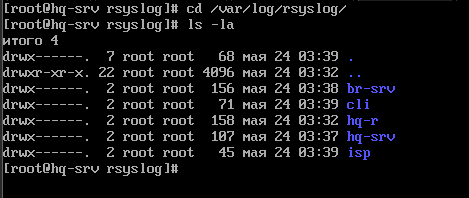

</details>

---

</br>

### <a id="module_3_2">2. Выполните настройку центра сертификации на базе HQ-SRV. </a>

<details> <summary> Open me! </summary>

</br>

**2.1. Выдайте сертификаты для SSH;**

**2.2. Выдайте сертификаты для веб серверов;**

</br>

Скачиваем пакет **easy-rsa** на **HQ-SRV**.

```console
[root@hq-srv ~]# dnf -y install easy-rsa
```

</br>

Копируем файл **easyrsa** в домашнюю директорию пользователя.

```console
[root@hq-srv ~]# cp /usr/share/easy-rsa/3.1.7/easy-rsa /home/adminn/easy-rsa
```

</br>

Переходим в домашнюю директорию пользователя и вводим команду **init-pki**, инициализируя инфраструктуру ключей.

```console
[root@hq-srv ~]# cd /home/adminn
[root@hq-srv adminn]# ./easyrsa init-pki
```

</br>

Создаем ЦС командой **build-ca**.

```console
[root@hq-srv adminn]# ./easyrsa build-ca
```

</br>

В ходе выполнения команды **build-ca** попросят ввести Passphrase, пустым его оставить нельзя, поэтому вводим **P@ssw0rd**. Также нас спросят Common Name, вводим **hq-srv.hq.work**.

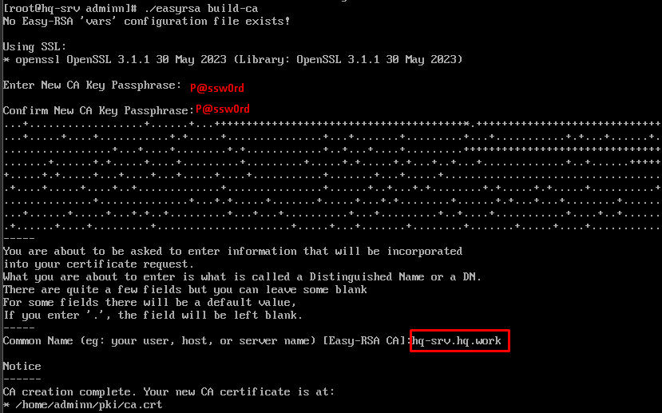

</br>

Генерируем запрос на подпись сертификата для **BR-SRV**. Common Name оставляем по умолчанию (br-srv.branch.work).

```console
[root@hq-srv adminn]# ./easyrsa gen-req br-srv.branch.work nopass
```

</br>


</br>

Создаем сам сертификат для **BR-SRV**. На моменте "Confirm request details" вводим **yes**, на моменте "Enter pass phrase" вводим **P@ssw0rd**.

```console
[root@hq-srv adminn]# ./easyrsa sign-req server br-srv.branch.work
```

</br>

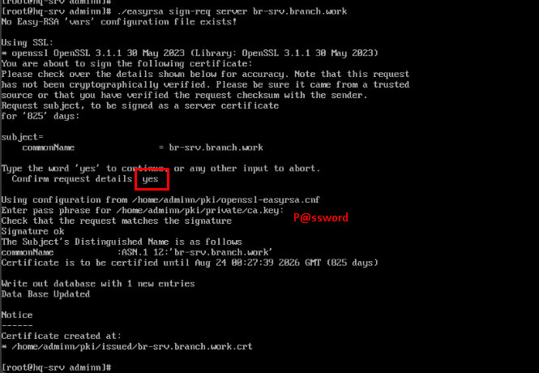

</br>

Теперь необходимо перекинуть сертификат на **BR-SRV**. Подключаемся по sftp на **BR-SRV** с **HQ-SRV**.

```console
[root@hq-srv adminn]# sftp -P 2222 branch-admin@192.168.33.10
Connected to 192.168.33.10.
sftp>
```

</br>

Перекидываем два файла через **put** - приватный ключ и сертификат.

```console
sftp> put /home/adminn/pki/issued/br-srv.branch.work.crt
sftp> put /home/adminn/pki/private/br-srv.branch.work.key
```

</br>

Переходим на **BR-SRV**. Редактируем конфигурационный файл **/etc/apache2/sites-available/default-ssl.conf**.

```console
root@BR-SRV:~# nano /etc/apache2/default-ssl.conf
```

</br>

Находим две строчки: **SSLCertificateFile** и **SSLCertificateKeyFile**. Пишем там пути к сертификату и ключу.

```console
...
SSLCertificateFile /home/branch-admin/br-srv.branch.work.crt
SSLCertificateKeyFile /home/branch-admin/br-srv.branch.work.key
...
```

</br>

Включаем модуль **ssl** для apache при помощи команды **a2enmod ssl**.

```console
root@BR-SRV:~# sudo a2enmod ssl
```

</br>

Включаем сайт **default-ssl** при помощи команды **a2ensite**.

```console
root@BR-SRV:~# sudo a2ensite default-ssl
```

</br>

Перезапускаем службу **apache2**.

```console
root@BR-SRV:~# systemctl restart apache2
root@BR-SRV:~# systemctl reload apache2
```

</br>

Заходим в браузер по IP-адресу **br-srv.branch.work** с использованием **https**.

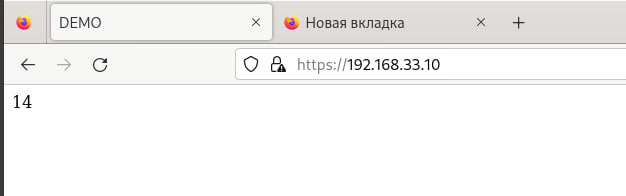

</br>

Тыкаем на замочек, затем "Подробнее".

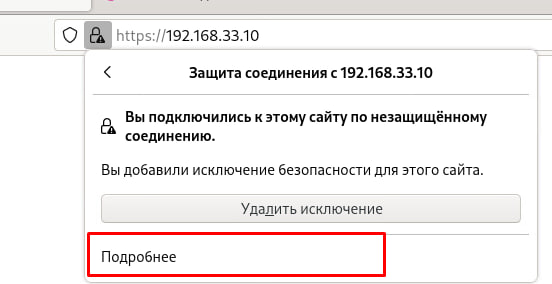

</br>

Видим всю инфу о сертификате и ЦС.

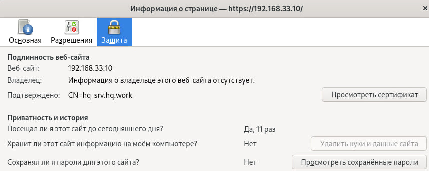

</details>

---

</br>

### <a id="module_3_3">3. Настройте SSH на всех Linux хостах. </a>

<details> <summary> Open me! </summary>

</br>

**3.1. Banner ( Authorized access only! );** 

**3.2. Установите запрет на доступ root;**

**3.3. Отключите аутентификацию по паролю;**

**3.4. Переведите на нестандартный порт;**

**3.5. Ограничьте ввод попыток до 4;**

**3.6. Отключите пустые пароли;**

**3.7. Установите предел времени аутентификации до 5 минут;** 

**3.8 Установите авторизацию по сертификату выданным HQ-SRV;**

</br>

На всех устройствах в домашних директориях пользователей должна быть директория **.ssh**. Если ее нет - необходимо ее создать, а также выставить права 700. Также директория должна быть создана от имени самого пользователя, которому принадлежит домашняя директория.

```console
[adminn@hq-srv ~]# mkdir /home/adminn/.ssh
[adminn@hq-srv ~]# chmod 700 /home/adminn/.ssh
```


</br>

При помощи **ssh-keygen** генерим пару ключей на **HQ-SRV**. Опять-таки от имени пользователя. Passhprase - пустой. Имя оставляем по умолчанию - id_rsa.

```console
[adminn@hq-srv ~]# cd .ssh
[adminn@hq-srv .ssh]# ssh-keygen
Enter file in which to save the key (/home/adminn/.ssh/id_rsa): 
Generating public/private rsa key pair.
Enter passphrase (empty for no passphrase):
Enter same passphrase again:
Your identification has been saved in demo_key
Your public key has been saved in demo_key.pub
```

</br>

Передаем с **HQ-SRV** публичный ключ на **BR-SRV**, **BR-R**, **HQ-R**.

```console
[adminn@hq-srv .ssh]# ssh-copy-id -i id_rsa.pub branch-admin@192.168.33.10
[adminn@hq-srv .ssh]# ssh-copy-id -i id_rsa.pub branch-admin@192.168.33.1
[adminn@hq-srv .ssh]# ssh-copy-id -i id_rsa.pub adminn@172.16.2.1
```

</br>

Открываем и редактируем конфиг SSH **/etc/ssh/sshd_config** на всех устройствах.

```console
nano /etc/ssh/sshd_config
```

```
Banner /etc/ssh/banner
Port 2222
LoginGraceTime 5m
PermitRootLogin no
MaxAuthTries 4
PubkeyAuthentication yes
PasswordAuthentication no
PermitEmptyPasswords no
```

</br>

Создаем и редактируем везде файл **/etc/ssh/banner**.

```console
touch /etc/ssh/banner
nano /etc/ssh/banner
```

```console
Authorized access only!
```

</br>

Перезагружаем службу **sshd** на всех устройствах.

```console
systemctl restart sshd
```

</br>

Проверяем подключение. Оно должно происходить автоматически, без запроса пароля, а также с появлением сообщения "Authorized access only!". Не забываем также указать порт.

```console
[adminn@hq-srv ~]# ssh -p 2222 adminn@172.16.2.1 
[adminn@hq-srv ~]# ssh -p 2222 branch-admin@192.168.33.1 
[adminn@hq-srv ~]# ssh -p 2222 branch-admin@192.168.33.10 
```

</br>


</details>

---

</br>

### <a id="module_3_4">4. Реализуйте антивирусную защиту по средствам ClamAV на устройствах HQ-SRV и BR-SRV. </a>

<details> <summary> Open me! </summary>

</br>

**4.1. Настройте сканирование системы раз в сутки с сохранением отчёта**

**4.2. Учтите, что сканирование должно проводится при условии, что от пользователей нет нагрузки**

</br>

Скачиваем на **HQ-SRV** пакеты **clamav**, **clamd**, **clamav-update**.

```console
[root@hq-srv ~]# dnf -y install clamav clamd clamav-update
```

</br>

На **BR-SRV** скачиваем просто один пакет **clamav**.

```console
root@BR-SRV:~# apt install clamav -y 
```

</br>

Открываем конфиг файл **freshclam.conf** на **HQ-SRV** и **BR-SRV**.

```console
[root@hq-srv ~]# nano /etc/freshclam.conf
```

```console
root@BR-SRV:~# nano /etc/clamav/freshclam.conf
```

</br>

На **BR-SRV** надо дать доступ для записи на этот файл.

```console
root@BR-SRV:~# chmod +w /etc/clamav/freshclam.conf
```

</br>

Находим строчку **"DatabaseMirror"** и меняем ее значение на https://clamav-mirror.ru. Если строчки две - оставляем одну.

```console
...
DatabaseMirror https://clamav-mirror.ru
...
```

</br>

Пробуем обновить БД ClamAV при помощи команды **freshclam**.

```console
freshclam
```

</br>

Если выскакивают ошибки по типу "CDN", делаем следующее. Если ошибок нет, едем дальше.

```console
mv /var/lib/clamav/freshclam.dat /var/lib/clamav/freshclam.dat.old
```

</br>

После этого снова пробуем выполнить обновление командой **freshclam**.

</br>

После успешного обновления, создаем скрипт **/opt/clamscan_home.sh**, а также файл **/var/log/clamscan_home.log**

```console
touch /opt/clamscan_home.sh
chmod +x clamscan_home.sh
touch /var/log/clamscan_home.log
```

</br>

Редактируем **clamscan_home.sh**.

```console
nano /opt/clamscan_home.sh
```

```console
#!/bin/bash
clamscan -i -r /home/ >> /var/log/clamscan_home.log
```

</br>

Проверяем выполнение скрипта его запуском. 

```console
/opt/clamscan_home.sh
```

</br>

> Примечание: выполнение скрипта в среднем занимает 2 минуты, если вы хотите ускорить этот процесс, попробуйте поменять директорию /home/ в скрипте на другую, где поменьше файлов.

</br>

Файл с логами после выполнения скрипта не должен быть пустым.

```console
cat /var/log/clamscan_home.log
```

</br>

Теперь делаем запуск скрипта каждый день. Пишем **crontab -e**. Выбираем редактор nano (1).

```console
crontab -e
```

</br>

> Примечание: на HQ-SRV чтобы открыть crontab с nano, пишем "EDITOR=nano crontab -e"

</br>

В конце файла пишем следующую строчку. Она означает запуск скрипта каждый день в 01:00 ночи.

```console
0 1 * * * /opt/clamscan_home.sh
```


</details>

---

</br>

### <a id="module_3_5">5. Настройте систему управления трафиком на роутере BR-R для контроля входящего трафика в соответствии со следующими правилами: </a>

<details> <summary> Open me! </summary>

</br>

**5.1. Разрешите подключения к портам DNS (порт 53), HTTP (порт 80) и HTTPS (порт 443) для всех клиентов. Эти порты необходимы для работы настраиваемых служб.**

**5.2. Разрешите работу выбранного протокола организации защищенной связи. Разрешение портов должно быть выполнено по принципу «необходимо и достаточно».**

**5.3. Разрешите работу протоколов ICMP (протокол управления сообщениями Internet).**

**5.4. Разрешите работу протокола SSH (Secure Shell) (SSH используется для безопасного удаленного доступа и управления устройствами).**

**5.5. Запретите все прочие подключения.**

**5.6. Все другие подключения должны быть запрещены для обеспечения безопасности сети.**

</br>

Задаем политику по умолчанию для цепочки **INPUT**.

```console
root@BR-R:~# iptables -P INPUT DROP
```

</br>

Вводим следующие правила **iptables** на **BR-R**.

```console
root@BR-R:~# iptables -A INPUT -p udp --dport 53 -j ACCEPT
root@BR-R:~# iptables -A INPUT -p tcp --dport 53 -j ACCEPT
root@BR-R:~# iptables -A INPUT -p tcp --dport 80 -j ACCEPT
root@BR-R:~# iptables -A INPUT -p tcp --dport 443 -j ACCEPT
root@BR-R:~# iptables -A INPUT -p tcp --dport 2222 -j ACCEPT
root@BR-R:~# iptables -A INPUT -p icmp -j ACCEPT
root@BR-R:~# iptables -A INPUT -p gre -j ACCEPT
root@BR-R:~# iptables -A INPUT -p ospf -j ACCEPT
```

</br>

Устанавливаем пакет **iptables-persistent**, если он не скачан.

```console
root@BR-R:~# apt install iptables-persistent -y
```

</br>

Сохраняем правила при помощи **iptables-save**.

```console
root@BR-R:~# iptables-save > /etc/iptables/rules.v4
```

</br>


</details>

---

</br>

### <a id="module_3_6">6. Настройте виртуальный принтер с помощью CUPS для возможности печати документов из Linux-системы на сервере BR-SRV.</a>

<details> <summary> Open me! </summary>

</br>

Скачиваем пакеты **cups** и **cups-pdf** на **BR-SRV**.

```console
root@BR-SRV:~# apt install cups cups-pdf -y
```

</br>

Запускаем службу **cups**.

```console
root@BR-SRV:~# /etc/init.d/cups start
```

</br>

Вводим команду **lpstat -t -d** и проверяем, все ли четко с принтером.

```console
root@BR-SRV:~# lpstat -t -d
планировщик запущен
назначение системы по умолчанию: PDF
устройство для PDF: cups-pdf:/
PDF принимает запросы с момента Пн 20 мая 2024 13:45:52
принтер PDF свободен. Включен с момента Пн 20 мая 2024 13:45:52
назначение системы по умолчанию: PDF
```

</br>

Залетаем на **localhost:631** в браузере **BR-SRV**.

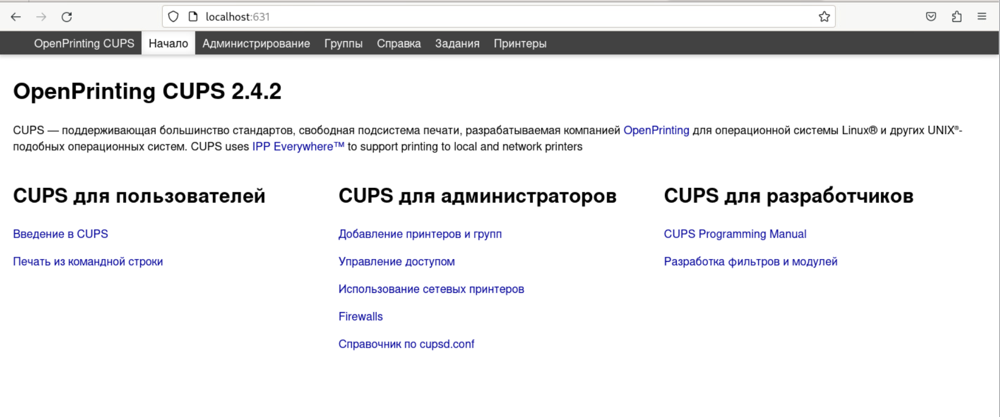

</br>

Заходим в раздел "Printers". Там должен быть принтер **PDF**.

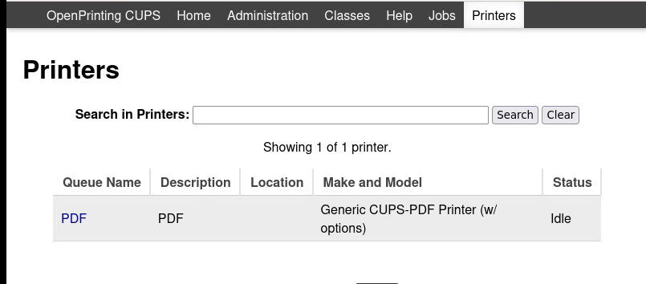

</br>

Жмем **Win+R** и пишем **system-config-printer**.


</br>

Там должен лежать принтер **PDF**. Можно посмотреть его свойства.


</br>

<details> <summary>Что делать если нету принтера PDF?</summary>

</br>

Добавляем новый принтер (CUPS-PDF (Virtual PDF Printer)) (если у вас его нет в панели администрирования CUPS).

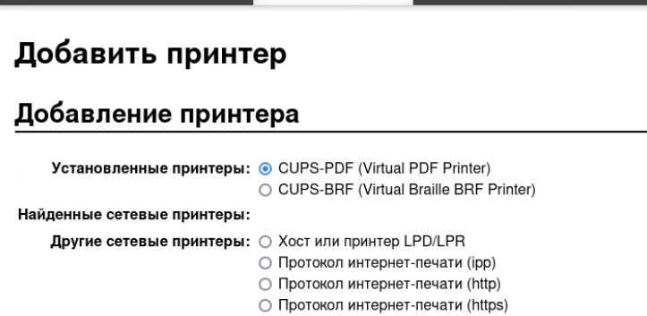


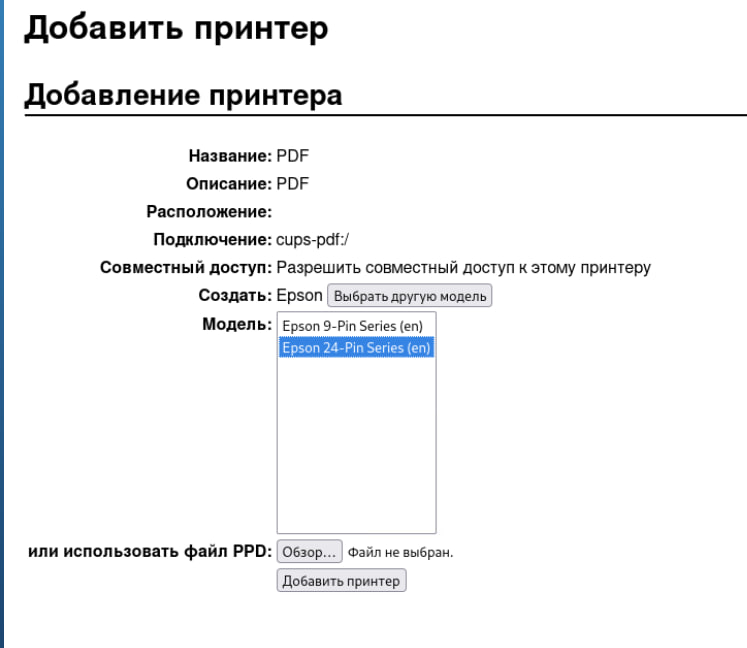

После добавления он автоматически добавиться и в систему.


</details>

</details>

---

</br>

### <a id="module_3_7">7. Между офисами HQ и BRANCH установите защищенный туннель, позволяющий осуществлять связь между регионами с применением внутренних адресов.</a>

<details> <summary> Open me! </summary>

</br>

Скачиваем на **HQ-R** и **BR-R** пакет **network-manager**.

```console
root@HQ-R:~# apt install network-manager -y
root@BR-R:~# apt install network-manager -y
```

</br>

Вводим команду **nmtui** на обоих устройствах.

```console
root@HQ-R:~# nmtui
root@BR-R:~# nmtui
```

</br>

Попадаем в интерфейс программы. Нажимаем на "Изменить подключение".


</br>

Добавляем новое подключение.

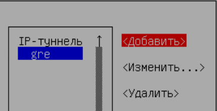

</br>

Тип подключения выбираем - "**IP-туннель**".


</br>

Редактируем конфигурацию подключения - **HQ-R**. В качестве локального IP-адреса используем внешний IP (который ведет в сторону ISP), в качестве удаленного IP-адреса - внешний адрес **BR-R**. Также конфигурируем IPv4 - та же подсеть должна использоваться и на BR-R.

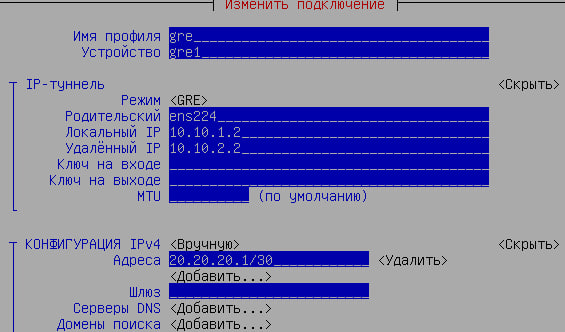

</br>

Аналогичным образом редактируем подключение и на **BR-R**.

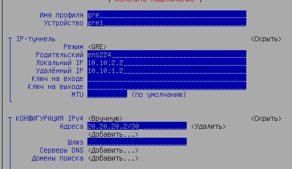

</br>

Также не забываем активировать созданное подключение.

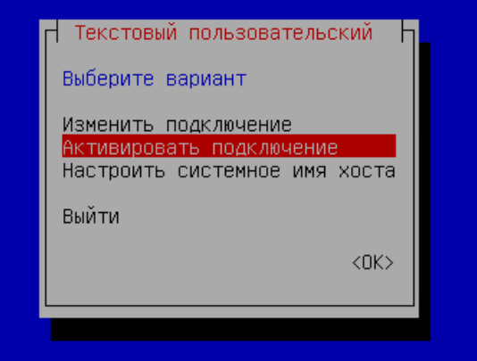


</br>

Теперь заворачиваем трафик до локальных сетей при помощи ip route.

```console
root@BR-R:~# ip route add 172.16.2.0/30 via 20.20.20.1
```

```console
root@HQ-R:~# ip route add 192.168.33.0/28 via 20.20.20.2
```

</br>

Проверяем при помощи **traceroute** на **HQ-SRV** и **BR-SRV**. 

```console
root@BR-SRV:~# traceroute 172.16.2.2
traceroute to 172.16.2.2 (172.16.2.2), 30 hops max, 60 byte packets
1 br-r.branch.work (192.168.33.1) 7.911 ms  7.342 ms  7.181 ms
2 * * *
3 hq-srv.hq.work (172.16.2.2)  15.059 ms  14.771 ms  14.964 ms
```

```console
[root@hq-srv ~]# traceroute 192.168.33.10
traceroute to 192.168.33.10 (192.168.33.10), 30 hops max, 60 byte packets
1 _gateway (172.16.2.1)  4.651 ms  5.327 ms  5.020 ms
2 * * *
2 192.168.33.10 (192.168.33.10) 37.619 ms  49.039 ms  49.976 ms
```

</br>

Как видно из вывода команды **traceroute**, промежуточные IP-адреса не используются, все четко

</details>

---

</br>

### <a id="module_3_8">8. По средствам уже настроенного мониторинга установите следующие параметры.</a>

<details> <summary> Open me! </summary>

</br>

**8.1. Warning**

*8.1.1 Нагрузка процессора больше или равна 70%*

*8.1.2. Заполненность оперативной памяти больше или равна 80%*

*8.1.3. Заполненность диска больше или равна 85%*

**8.2. Напишите план действия при получении Warning сообщений**

</br>

это пиздец)

</details>

---

</br>

### <a id="module_3_9">9. Настройте программный RAID 5 из дисков по 1 Гб, которые подключены к машине BR-SRV.</a>

<details> <summary> Open me! </summary>

</br>

Добавляем три диска объемом по 1 Гб каждый для **BR-SRV**.

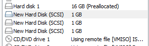

</br>

Устанавливаем пакеты **fdisk** и **mdadm**.

```console
root@BR-SRV:~# apt install fdisk mdadm -y
```

</br>

Проверяем через **fdisk -l** наличие подключенных дисков - **/dev/sdb**, **/dev/sdc**, **/dev/sdd**.


</br>

Создаем RAID-массив при помощи утилиты **mdadm**.

```console
root@BR-SRV:~# mdadm --create -v /dev/md5 --level=5 --raid-devices=3 /dev/sdb /dev/sdc /dev/sdd
```

</br>

Проверить создан ли RAID-массив можно следующей командой: 

```console
root@BR-SRV:~# cat /proc/mdstat
```

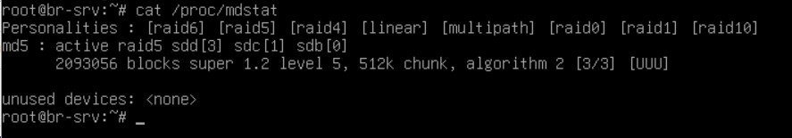

</br>

Размечаем файловую систему ext4 на массиве при помощи утилиты **mkfs.ext4**.

```console
root@BR-SRV:~# mkfs.ext4 /dev/md5
```

</br>

В выводе команды **fdisk -f** должен быть /dev/md5.


</br>

Делаем монтирование /dev/md5 в /mnt при помощи команды **mount**.

```console
root@BR-SRV:~# mount /dev/md5 /mnt
```

</br>

В выводе команды **df -h** должен быть /dev/md5.

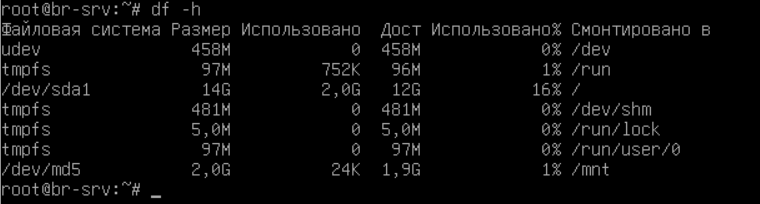

</br>

Теперь необходимо настроить автоматическую сборку массива. Открываем конфигурационный файл **/etc/mdadm/mdadm.conf**.

```console
root@BR-SRV:~# nano /etc/mdadm/mdadm.conf
```

</br>

В конце файла пишем команду.

```console
...
mdadm --detail -scan >> /etc/mdadm/mdadm.conf
```

</br>

Обновляем **initramfs** при помощи команды:

```console
root@BR-SRV:~# update-initramfs -u
```

</br>

Настраиваем автомонтирование. Редактируем файл **/etc/fstab**. В конце файла пишем строчку:

```console
root@BR-SRV:~# nano /etc/fstab
```

```console
...
/dev/md5      /mnt       ext4      defaults      0    0
```

</br>

После этого перезагружаем систему и проверяем наличие массива в системе командой **fdisk -l**.

</details>

---

</br>

### <a id="module_3_10">10. Настройте Bacula на сервере HQ-SRV для резервного копирования etc на сервере BR-SRV.</a>

<details> <summary> Open me!</summary>

</br>

Скачиваем на **HQ-SRV** пакет **mariadb-server**.

```console
[root@hq-srv ~]# dnf -y install mariadb-server
```

</br>

Запускам службу **mariadb** и добавляем ее в автозапуск.

```console
[root@hq-srv ~]# systemctl start mariadb
[root@hq-srv ~]# systemctl enable mariadb
```

</br>

Скачиваем пакеты **bacula** на **HQ-SRV**.

```console
[root@hq-srv ~]# dnf -y install bacula-*
```

</br>

Также скачиваем клиентский пакет **bacula-fd** на **BR-SRV**.

```console
root@BR-SRV:~# apt install bacula-fd -y
```

</br>

Заходим в **mariadb** на **HQ-SRV**. Создаем базу данных с именем **"bacula"**, пользователя **"bacula"@localhost"**, а также выдаем права этому пользователю на БД.

```console
[root@hq-srv ~]# sudo mysql -u root -p
mariadb> CREATE DATABASE bacula;
mariadb> CREATE USER "bacula"@"localhost" IDENTIFIED by "P@ssw0rd";
mariadb> GRANT ALL PRIVLEGES ON bacula.* TO "bacula"@"localhost";
mariadb> exit;
```

</br>

Вводим команду **alternatives --config libbascats.so**. В ходе выполнения команды жмем "1", затем "Enter".

```console
[root@hq-srv ~]# alternatives --config libbascats.so
```

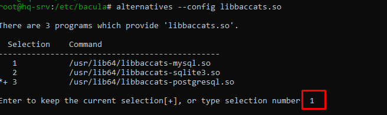

</br>

Переходим в директорию **/usr/libexec/bacula**. Выполняем скрипт **make_mysql_tables**, как это продемонстрировано ниже.

```
[root@hq-srv ~]# cd /usr/libexec/bacula
[root@hq-srv ~]# ./make_mysql_tables -u bacula -p
Enter password: P@ssw0rd
```

</br>

Также заходим на **BR-R** и добавляем разрешающие правила для работы портов Bacula.

```console
root@BR-R:~# iptables -A INPUT -d tcp --dport 9101 -j ACCEPT
root@BR-R:~# iptables -A INPUT -d tcp --dport 9102 -j ACCEPT
root@BR-R:~# iptables -A INPUT -d tcp --dport 9103 -j ACCEPT
```

</br>

**ВНИМАНИЕ! Вы находитесь на ПЕРЕПУТЬЕ. Дальнейший сценарий выполнения задания зависит от Вас. Всего их два:**

</br>

<details> <summary> Сценарий №1. Нереальный. </summary>

</br>

> Я серьезно, по такому сценарию вы никогда не успеете сделать это задание. Проще забить хуй.

</br>

Редактируем конфигурационный файл **/etc/bacula/bacula-dir.conf** на **HQ-SRV**.

```console
[root@hq-srv ~]# nano /etc/bacula/bacula-dir.conf
```

```console
Director {
  Name = bacula-dir
  DIRport = 9101
  DIRaddress = 172.16.2.2
  QueryFile = "/etc/bacula/query.sql"
  WorkingDirectory = "/var/spool/bacula"
  PidDirectory = "/var/run"
  Maximum Concurrent Jobs = 20
  Password = "P@ssw0rd"
  Messages = Daemon
}

JobDefs {
  Name = "DefaultJob"
  Type = Backup
  Level = Full
  Client = br-srv
  FileSet = "Full Set"
  Schedule = "WeeklyCycle"
  Storage = File1
  Messages = Standard
  Pool = File
  SpoolAttributes = yes
  Priority = 10
  Write Bootstrap = "/var/spool/bacula/%c.bsr"
}

Job {
  Name = "BackupClient1"
  JobDefs = "DefaultJob"
}

Job {
  Name = "RestoreFiles"
  Type = Restore
  Client = br-srv
  Storage = File1
  FileSet="Full Set"
  Pool = File
  Messages = Standard
  Where = /tmp/bacula-restores
}

FileSet {
  Name = "Full Set"
  Include {
    Options {
      signature = MD5
    }
    File = /etc/
  }
}

Storage {
  Name = File1
  SDPort = 9103
  Address = 172.16.2.2
  Maximum Concurrent Jobs = 20
  Password = "P@ssw0rd"
  Device = FileStorage
  MediaType = File1
}

Schedule {
  Name = "WeeklyCycle"
  Run = Full 1st sun at 23:05
  Run = Differential 2nd-5th sun at 23:05
  Run = Incremental mon-sat at 23:05
}

Client {
  Name = br-srv
  Address = 192.168.33.10
  FDPort = 9102
  Catalog = MyCatalog
  Password = "P@ssw0rd"
  File Retention = 60 days
  Job Retention = 6 months
  AutoPrune = yes
}

Catalog {
  Name = MyCatalog
  dbname = "bacula"; dbuser = "bacula"; dbpassword = "P@ssw0rd"; dbaddress="localhost";
}

Messages {
  Name = Standard
  mailcommand = "/usr/sbin/bsmtp -h localhost -f \"\(Bacula\) \<%r\>\" -s \"Bacula: %t %e of %c %l\" %r"
  operatorcommand = "/usr/sbin/bsmtp -h localhost -f \"\(Bacula\) \<%r\>\" -s \"Bacula: Intervention needed for %j\" %r"
  mail = root@localhost = all, !skipped
  operator = root@localhost = mount
  console = all, !skipped, !saved
  append = "/var/log/bacula/bacula.log" = all, !skipped
  catalog = all
}

Messages {
  Name = Daemon
  mailcommand = "/usr/sbin/bsmtp -h localhost -f \"\(Bacula\) \<%r\>\" -s \"Bacula daemon message\" %r"
  mail = root@localhost = all, !skipped
  console = all, !skipped, !saved
  append = "/var/log/bacula/bacula.log" = all, !skipped
}

Pool {
  Name = File
  Pool Type = Backup
  Recycle = yes
  AutoPrune = yes
  Volume Retention = 365 days
  Maximum Volume Bytes = 50G
  Maximum Volumes = 100
  Label Format = "Vol-"
}
```

</br>

- **172.16.2.2** - IP-адрес **HQ-SRV**.
- **192.168.33.10** - IP-адрес **BR-SRV**.
- Остальные параметры оставляем такие же.

</br>

Редактируем конфигурационный файл **/etc/bacula/bacula-sd.conf** на **HQ-SRV**.

```console
[root@hq-srv ~]# nano /etc/bacula/bacula-sd.conf
```

```console
Storage {
  Name = File1
  SDPort = 9103
  SDAddress = 172.16.2.2
  WorkingDirectory = "/var/spool/bacula"
  Pid Directory = "/var/run"
  Plugin Directory = "/usr/lib64/bacula"
  Maximum Concurrent Jobs = 20
}

Director {
  Name = bacula-dir
  Password = "P@ssw0rd"
}

Device {
  Name = FileStorage
  Media Type = File1
  Archive Device = /tmp
  LabelMedia = yes;
  Random Access = Yes;
  AutomaticMount = yes;
  RemovableMedia = no;
  AlwaysOpen = yes;
  Maximum Concurrent Jobs = 5
}

Messages {
  Name = Standard
  director = bacula-dir = all
}
```

</br>

Редактируем конфигурационный файл **/etc/bacula/bconsole.conf** на **HQ-SRV**.

```console
[root@hq-srv ~]# nano /etc/bacula/bconsole.conf
```

```console
Director {
  Name = bacula-dir
  DIRport = 9101
  Address = 172.16.2.2
  Password = "P@ssw0rd"
}
```

</br>

Вводим команду **bconsole -t**, чтобы проверить, все ли в порядке с конфигурацией. Если команда ничего не вывела - все хорошо (вроде).

```console
[root@hq-srv ~]# bconsole -t
[root@hq-srv ~]#
```

</br>

Редактируем конфигурационный файл **/etc/bacula/bacula-fd.conf** на **BR-SRV**.

```console
root@BR-SRV:~# nano /etc/bacula/bacula-fd.conf
```

```console
Director {
  Name = bacula-dir
  Password = "P@ssw0rd"
}

FileDaemon {                          # this is me
  Name = br-srv
  FDport = 9102                  # where we listen for the director
  WorkingDirectory = /var/lib/bacula
  Pid Directory = /run/bacula
  Maximum Concurrent Jobs = 20
  Plugin Directory = /usr/lib/bacula
  FDAddress = 192.168.33.10
}

Messages {
  Name = Standard
  director = br-srv.branch.work-dir = all, !skipped, !restored
}
```

</br>

Запускаем необходимые службы на **HQ-SRV** и **BR-SRV** и добавляем их в автозапуск.

```console
[root@hq-srv ~]# systemctl start bacula-dir
[root@hq-srv ~]# systemctl start bacula-sd
```

```console
[root@hq-srv ~]# systemctl enable bacula-dir
[root@hq-srv ~]# systemctl enable bacula-sd
```

```console
root@BR-SRV:~# systemctl restart bacula-fd
```

</br>

Заходим в **bconsole** на **BR-SRV**. Запускаем джобу для бэкапа директории **/etc/**.

```console
[root@hq-srv ~]# bconsole
* run
* 1
* yes
```

</br>

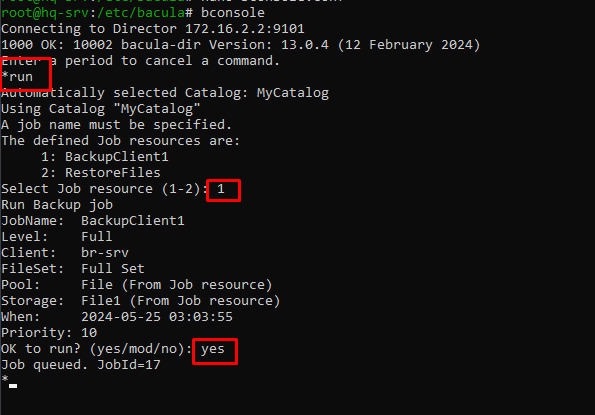

</br>

Вводим команду **status dir**. Видим, что наш бэкап имеет статус "ОК".

```console
* status dir
```

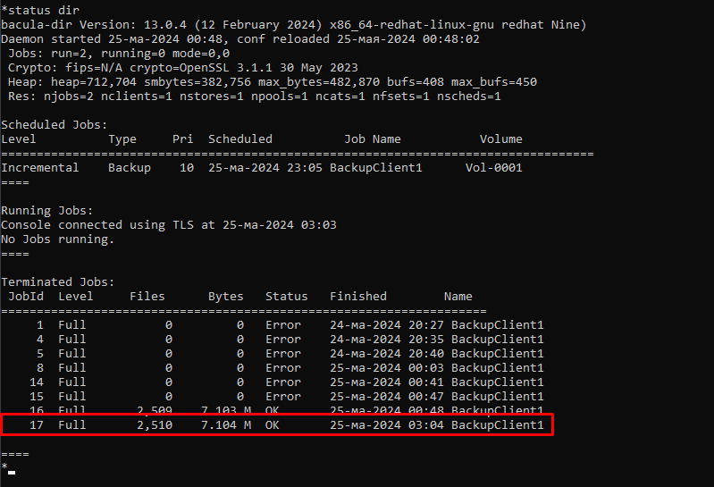

</br>

</details>

<details> <summary> Сценарий №2. Может быть реальный. </summary>

</br>

потом

</details>

</details>
