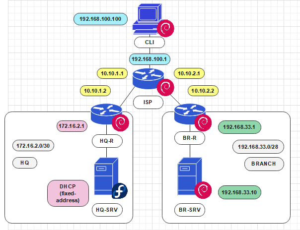

# Топология сети

 

> Примечание: около изображений узлов находятся логотипы дистрибутивов, которые на них используются. На всех, кроме HQ-SRV, используется Debian 12. На HQ-SRV же используется Fedora Server 39.

 

## Интерфейсы и IP-адреса устройств

 

## CLI

| Интерфейс | Port Group | IP              | Netmask             | Gateway       |
|-----------|------------|-----------------|---------------------|---------------|
| ens224    | CLI        | 192.168.100.100 | 255.255.255.0 (/24) | 192.168.100.1 |

 

## ISP

| Интерфейс | Port Group | IP            | Netmask               | Gateway |
| --------- | ---------- | ------------- | --------------------- | ------- |
| ens161    | CLI        | 192.168.100.1 | 255.255.255.0 (/24)   | -       |
| ens256    | HQ-ISP     | 10.10.1.1     | 255.255.255.252 (/30) | -       |
| ens224    | BR-ISP     | 10.10.2.1     | 255.255.255.252 (/30) | -       |

 

## HQ-R

| Интерфейс | Port Group | IP         | Netmask               | Gateway   |
| --------- | ---------- | ---------- | --------------------- | --------- |
| ens256    | HQ         | 172.16.2.1 | 255.255.255.252 (/30) | -         |
| ens224    | HQ-ISP     | 10.10.1.2  | 255.255.255.252 (/30) | 10.10.1.1 |

 

## HQ-SRV

| Интерфейс | Port Group | IP                | Netmask                      | Gateway           |
| --------- | ---------- | ----------------- | ---------------------------- | ----------------- |
| ens224    | HQ         | DHCP (172.16.2.2) | DHCP (255.255.255.252 (/30)) | DHCP (172.16.2.1} |

 

## BR-R

| Интерфейс | Port Group | IP           | Netmask               | Gateway   |
| --------- | ---------- | ------------ | --------------------- | --------- |
| ens256    | BR         | 192.168.33.1 | 255.255.255.240 (/28) | -         |
| ens224    | BR-ISP     | 10.10.2.2    | 255.255.255.252 (/30) | 10.10.2.1 |

 

## BR-SRV

| Интерфейс | Port Group | IP            | Netmask               | Gateway      |
| --------- | ---------- | ------------- | --------------------- | ------------ |
| ens224    | BR         | 192.168.33.10 | 255.255.255.240 (/28) | 192.168.33.1 |

 
